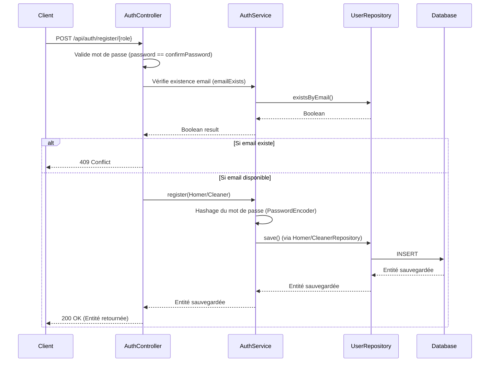
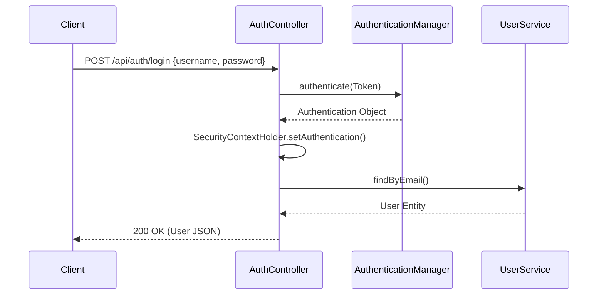

# Architecture Actuelle - Module d'Authentification

Ce document décrit le fonctionnement et l'architecture du module de Login / Inscription existant dans `sweethome-back`.

## Composants
- **AuthController** : Expose les Endpoints REST.
- **AuthService** : Logique métier d'inscription.
- **UserService / CustomUserDetailsService** : Gestion des utilisateurs et de Spring Security (récupération de l'utilisateur par email).
- **AuthenticationManager** : Spring Security, gère la vérification des Credentials.

## Flux existants (BPMN simplifié)

### 1. Inscription (Homer / Cleaner)

### 2. Connexion (Login)

### 3. Déconnexion (Logout)
- Endpoint : `POST /api/auth/logout`
- Action : Vide le contexte de sécurité (`SecurityContextHolder.clearContext()`).

## Points d'attention pour les Agents
- Le système utilise l'héritage JPA (`@Inheritance(strategy = InheritanceType.JOINED)`) pour séparer les `User` des `Homer` et `Cleaner`.
- Toute nouvelle information spécifique à un prestataire doit aller dans `cleaners`, et non dans `users`.
- Les mots de passe sont hashés en base (BCrypt assumé via Spring Security).
