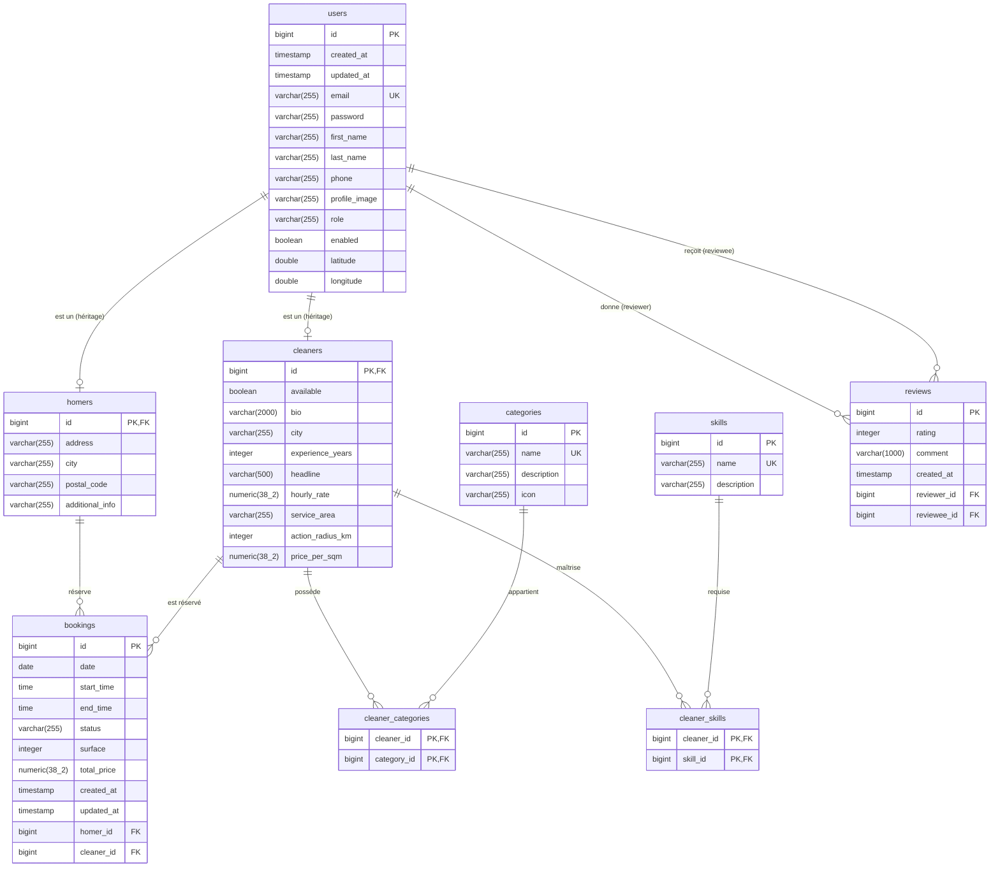

# État des lieux BDD - Modèle Physique de Données (MPD)

Ce document décrit le schéma actuel de la base de données PostgreSQL pour le projet Sweet-Home.

## Diagramme Entité-Relation (ERD)

## Description des tables
- **users** : Table parente gérant l'authentification (email/mot de passe), les rôles (HOMER, CLEANER, ADMIN) et la géolocalisation.
- **homers** : Table enfant de `users` (héritage JOINED sur `id`). Contient les adresses des particuliers.
- **cleaners** : Table enfant de `users` (héritage JOINED sur `id`). Contient les informations des prestataires (tarif, rayon d'action, bio).
- **categories / skills** : Référentiels des types de ménage et des compétences. Liés aux cleaners par les tables de jointure `cleaner_categories` et `cleaner_skills`.
- **reviews** : Système de notation entre utilisateurs (rating de 1 à 5).
- **bookings** : Réservations de prestations (lié à un homer et un cleaner, avec surface et prix total).

-- Ajout au Cycle 1 --
Nouvelles modifications apportées par la feature : feature-auto-cycle-1.md

-- Ajout au Cycle 2 --
Nouvelles modifications apportées par la feature : feature-auto-cycle-2.md

-- Ajout au Cycle 3 --
Nouvelles modifications apportées par la feature : feature-auto-cycle-3.md

-- Ajout au Cycle 1 --
Nouvelles modifications apportées par la feature : feature-auto-cycle-1.md

-- Ajout au Cycle 2 --
Nouvelles modifications apportées par la feature : feature-auto-cycle-2.md

-- Ajout au Cycle 3 --
Nouvelles modifications apportées par la feature : feature-auto-cycle-3.md

-- Ajout au Cycle 1 --
Nouvelles modifications pour : 

-- Ajout au Cycle 2 --
Nouvelles modifications pour : 

-- Ajout au Cycle 3 --
Nouvelles modifications pour : 

-- Ajout au Cycle 1 --
Nouvelles modifications pour : Complétion du Profil et Spécialisation (Onboarding Homer & Cleaner)