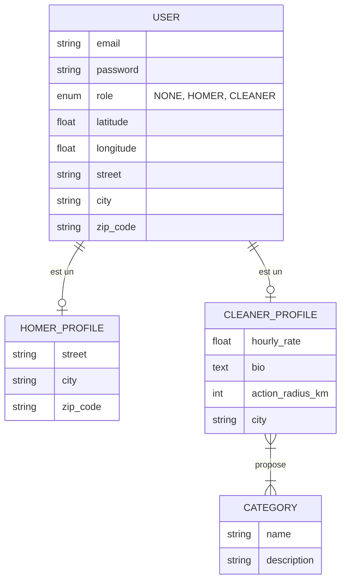
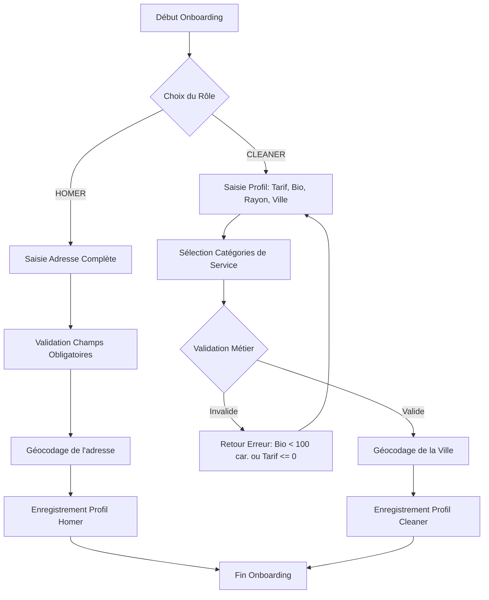

# Analyse Métier : Complétion du Profil et Spécialisation (Onboarding)

## 1. Modèle Conceptuel de Données (MCD)

## 2. Diagramme de Flux (BPMN)

## 3. Critères d'Acceptation

### Scénario 1 : Finalisation du profil Homer (Succès)
**Given** un utilisateur authentifié ayant le rôle "NONE"  
**When** il sélectionne le rôle "HOMER"  
**And** il renseigne une adresse complète (Rue, Ville, Code Postal)  
**Then** le système doit convertir l'adresse en coordonnées GPS (Latitude/Longitude)  
**And** le profil doit être enregistré avec le rôle "HOMER"  

### Scénario 2 : Finalisation du profil Cleaner (Succès)
**Given** un utilisateur authentifié ayant le rôle "NONE"  
**When** il sélectionne le rôle "CLEANER"  
**And** il renseigne un tarif horaire > 0  
**And** il renseigne une biographie de plus de 100 caractères  
**And** il sélectionne au moins une catégorie de service  
**And** il renseigne sa ville et son rayon d'action  
**Then** le système doit convertir la ville en coordonnées GPS (Latitude/Longitude)  
**And** le profil doit être enregistré avec le rôle "CLEANER" et ses spécialisations  

### Scénario 3 : Échec de validation - Biographie Cleaner insuffisante
**Given** un utilisateur en cours d'onboarding "CLEANER"  
**When** il soumet une biographie de moins de 100 caractères  
**Then** le système doit rejeter la soumission  
**And** un message d'erreur doit indiquer que la biographie est trop courte  

### Scénario 4 : Échec de validation - Tarif Cleaner invalide
**Given** un utilisateur en cours d'onboarding "CLEANER"  
**When** il soumet un tarif horaire inférieur ou égal à zéro  
**Then** le système doit rejeter la soumission  
**And** un message d'erreur doit indiquer que le tarif doit être positif  

### Scénario 5 : Échec de validation - Absence de catégorie pour Cleaner
**Given** un utilisateur en cours d'onboarding "CLEANER"  
**When** il ne sélectionne aucune catégorie de service  
**Then** le système doit rejeter la soumission  
**And** un message d'erreur doit exiger la sélection d'au moins une catégorie