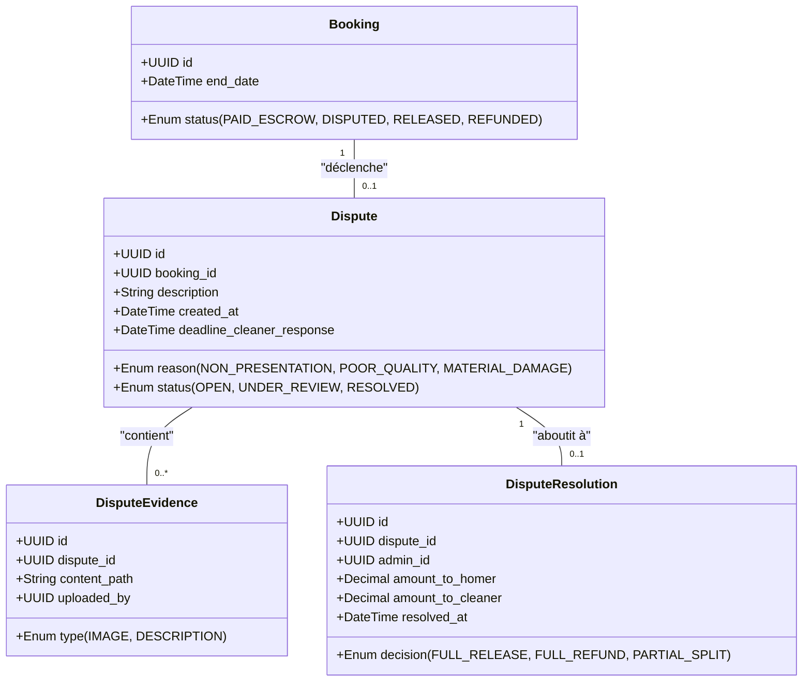
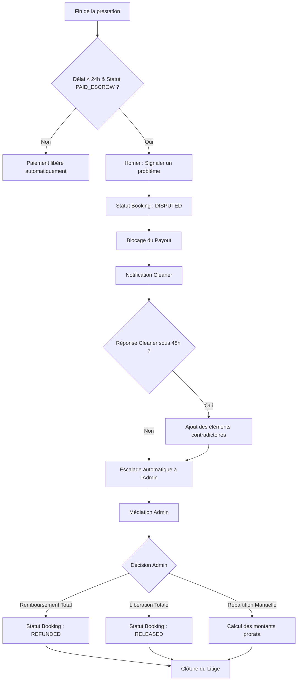

Voici l'analyse métier structurée pour la feature **Centre de Résolution des Litiges et Gestion des Sinistres**.

### 1. Modèle Conceptuel de Données (MCD) - Mermaid.js
Ce modèle intègre la nouvelle entité `Dispute` et ses relations avec le système de réservation et de paiement existant.

### 2. Diagramme de flux (BPMN) - Mermaid.js
Ce diagramme décrit le cycle de vie du litige, de l'ouverture à la résolution finale par l'administrateur.

### 3. Critères d'Acceptation (Given/When/Then)

#### Scénario 1 : Ouverture d'un litige valide par le Homer
*   **Given** Une réservation avec le statut `PAID_ESCROW`.
*   **And** La date de fin de prestation date de moins de 24 heures.
*   **When** Le Homer soumet le formulaire "Signaler un problème" avec un motif valide et une description.
*   **Then** Le statut de la réservation devient `DISPUTED`.
*   **And** Le système bloque tout transfert de fonds vers le portefeuille du Cleaner.
*   **And** Le Cleaner reçoit une notification immédiate.

#### Scénario 2 : Tentative d'ouverture de litige hors délai
*   **Given** Une réservation avec le statut `PAID_ESCROW`.
*   **And** La date de fin de prestation date de plus de 24 heures.
*   **When** Le Homer tente d'accéder au bouton "Signaler un problème".
*   **Then** Le bouton est désactivé ou l'action est rejetée avec un message d'erreur indiquant l'expiration du délai de recours.

#### Scénario 3 : Réponse contradictoire du Cleaner
*   **Given** Un litige ouvert avec le statut `OPEN`.
*   **And** Le délai de 48h pour la réponse n'est pas expiré.
*   **When** Le Cleaner soumet ses preuves et sa description des faits.
*   **Then** Le statut du litige passe à `UNDER_REVIEW`.
*   **And** Les éléments sont ajoutés au dossier consultable par l'administrateur.

#### Scénario 4 : Résolution par arbitrage Administrateur (Remboursement)
*   **Given** Un litige au statut `UNDER_REVIEW`.
*   **When** L'administrateur valide une décision de "Remboursement Total".
*   **Then** Le statut de la réservation passe à `REFUNDED`.
*   **And** Les fonds séquestrés sont intégralement recrédités sur le moyen de paiement du Homer.
*   **And** Le dossier de litige est marqué comme `RESOLVED` et devient immuable.

#### Scénario 5 : Résolution par arbitrage Administrateur (Répartition manuelle)
*   **Given** Un litige au statut `UNDER_REVIEW`.
*   **When** L'administrateur saisit une répartition (ex: 50% Homer / 50% Cleaner).
*   **Then** Le système calcule les montants respectifs.
*   **And** Le Cleaner reçoit sa part dans son `CLEANER_WALLET`.
*   **And** Le Homer est remboursé de la part restante.
*   **And** Le statut final de la réservation devient `RELEASED` (partiel).