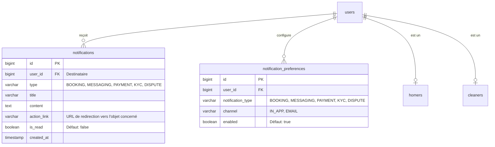
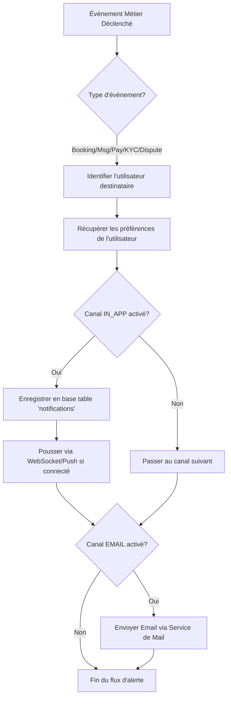

J'analyse l'état actuel de la base de données et de l'architecture pour intégrer le système de notifications de manière cohérente.

Voici le dossier de conception fonctionnelle pour le **Système de Notifications Centralisé et Alertes Multi-Canal**.

### 1. Modèle Conceptuel de Données (MCD) mis à jour

Ce diagramme intègre la persistance des notifications et la gestion fine des préférences utilisateurs.

---

### 2. Diagramme de flux BPMN (Logique d'envoi)

Ce flux décrit le mécanisme de déclenchement d'une notification suite à un événement métier (ex: une nouvelle réservation).

---

### 3. Critères d'Acceptation (Gherkin)

#### Scénario 1 : Réception d'une notification In-App
**Given** un utilisateur "Homer" connecté à son tableau de bord
**And** une nouvelle demande de réservation est créée pour lui par un "Cleaner"
**When** le système traite l'événement de réservation
**Then** une nouvelle entrée est créée dans la table `notifications` avec `is_read = false`
**And** le badge de notification sur l'icône "cloche" s'incrémente en temps réel sur l'interface de l'Homer.

#### Scénario 2 : Respect des préférences de notification (Email)
**Given** un utilisateur "Cleaner" ayant désactivé les notifications par "Email" pour le type "MESSAGING"
**When** un "Homer" lui envoie un message via la messagerie interne
**Then** le système enregistre la notification pour le canal "IN_APP"
**But** le système n'envoie aucun email au "Cleaner" conformément à ses réglages.

#### Scénario 3 : Marquage d'une notification comme lue
**Given** un utilisateur visualisant sa liste de notifications non lues
**When** l'utilisateur clique sur une notification ou sur le bouton "Tout marquer comme lu"
**Then** l'état `is_read` de la notification passe à `true` en base de données
**And** le compteur de notifications non lues est mis à jour immédiatement.

#### Scénario 4 : Redirection contextuelle (Action Link)
**Given** une notification de type "KYC" informant l'utilisateur que son document a été refusé
**When** l'utilisateur clique sur la notification
**Then** l'application redirige l'utilisateur directement vers la page de gestion de son profil/documents (action_link).