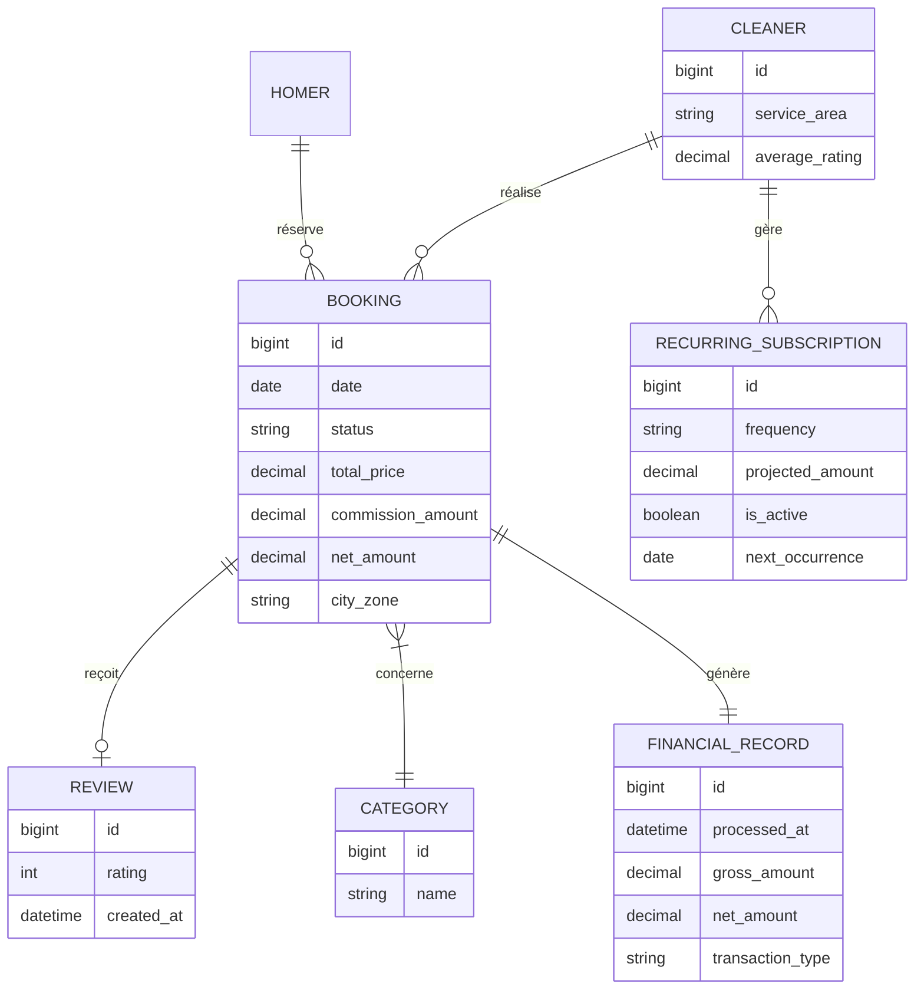
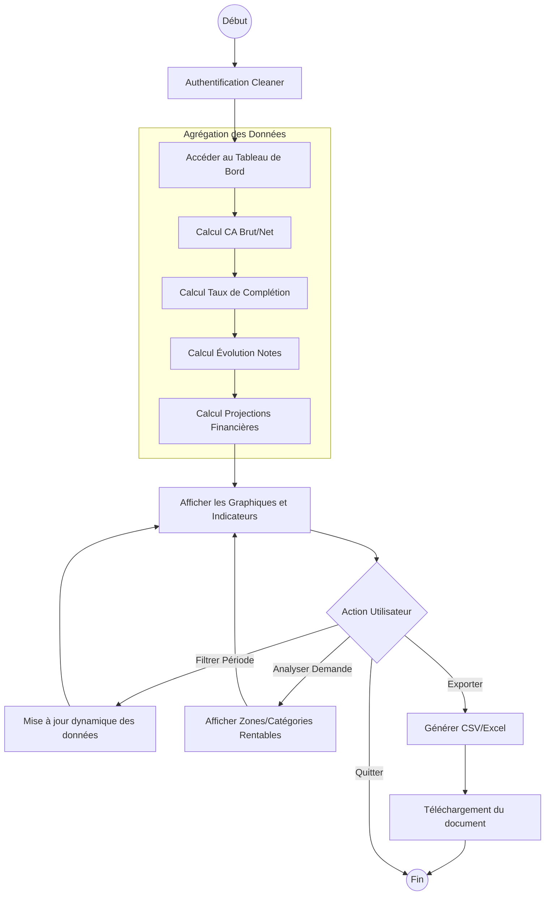

Voici le livrable structuré pour la feature **Tableau de Bord Analytique et Suivi des Revenus pour les Cleaners**.

---

### 1. Modèle Conceptuel de Données (MCD) mis à jour

Ce modèle intègre les dimensions nécessaires à l'analyse (temporelle, géographique, catégorielle) et les indicateurs financiers issus des cycles précédents.

---

### 2. Diagramme de flux BPMN (Processus de Consultation et d'Analyse)

Ce flux décrit le parcours utilisateur du Cleaner pour piloter son activité.

---

### 3. Critères d'Acceptation (Gherkin)

#### Scénario 1 : Synthèse financière et filtrage temporel
**Etant donné** que je suis un Cleaner connecté avec des prestations passées
**Quand** j'accède à mon tableau de bord analytique
**Et que** je sélectionne une période (ex: "Mois dernier")
**Alors** le système affiche le Chiffre d'Affaires Brut total
**Et** le montant net après déduction des commissions de la plateforme
**Et** la variation par rapport à la période précédente.

#### Scénario 2 : Suivi des indicateurs de performance (KPIs) et satisfaction
**Etant donné** que je consulte mes statistiques de performance
**Alors** le système doit calculer le taux de complétion (Prestations honorées / Total des réservations acceptées)
**Et** afficher un graphique d'évolution de ma note moyenne sur les 12 derniers mois
**Et** indiquer le nombre total de commentaires reçus.

#### Scénario 3 : Analyse de la demande et rentabilité
**Etant donné** que je souhaite optimiser mes déplacements
**Quand** je consulte la section "Analyse de la demande"
**Alors** le système affiche la répartition du CA par catégorie de service (ex: 60% Ménage standard, 40% Repassage)
**Et** identifie les zones géographiques (villes ou quartiers) générant le plus de revenus.

#### Scénario 4 : Projections financières (Revenus à venir)
**Etant donné** que j'ai des réservations confirmées pour le futur et des abonnements actifs
**Alors** le système doit afficher une estimation des revenus "sécurisés" pour les 30 prochains jours
**Et** distinguer les revenus issus de prestations ponctuelles des revenus issus d'abonnements récurrents.

#### Scénario 5 : Exportation des données comptables
**Etant donné** que je suis sur le tableau de bord avec un filtre actif
**Quand** je clique sur le bouton "Exporter les données"
**Alors** le système génère un fichier (CSV ou Excel) contenant le détail de chaque transaction (Date, Client, Service, Brut, Commission, Net)
**Et** le téléchargement démarre automatiquement.