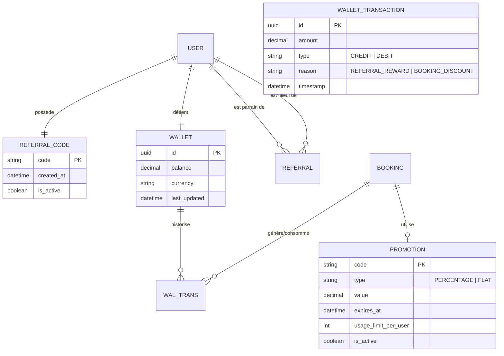
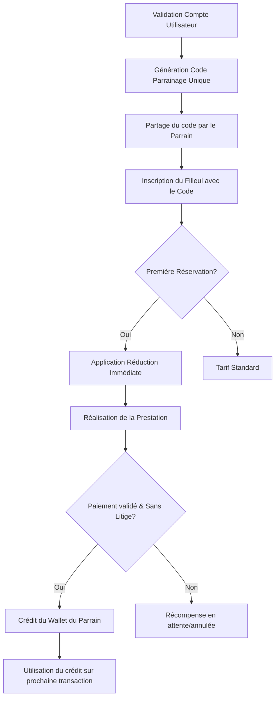

L'implémentation du **Système de Parrainage et de Fidélisation (Growth Engine)** nécessite une extension du modèle de données pour intégrer la gestion des portefeuilles virtuels, des codes de parrainage et des promotions administratives.

Voici l'analyse métier structurée pour cette feature.

### 1. Modèle Conceptuel de Données (MCD)

Ce modèle introduit les entités `ReferralCode`, `Promotion`, `Wallet` et `WalletTransaction` pour supporter la logique de parrainage et de crédit.

### 2. Diagramme de Flux (BPMN)

Ce diagramme détaille le cycle de vie du parrainage, de l'invitation à la récompense.

### 3. Critères d'Acceptation (Given/When/Then)

#### Scénario 1 : Génération automatique du code
**Given** Un nouvel utilisateur (Homer ou Cleaner) vient de faire valider son compte par le système.
**When** Le compte passe au statut "VALIDATED".
**Then** Un code de parrainage unique et permanent est généré et associé à son profil.

#### Scénario 2 : Utilisation d'un code de parrainage par un filleul
**Given** Un nouveau Homer souhaite effectuer sa première réservation.
**And** Il possède le code de parrainage de son parrain.
**When** Il saisit le code dans le champ "Code Promo/Parrainage" avant le paiement.
**Then** Le montant total à payer est réduit de la valeur définie (ex: 15%).
**And** La transaction est marquée comme liée à ce parrainage.

#### Scénario 3 : Récompense du parrain après service fait
**Given** Un filleul a effectué sa première prestation avec un code de parrainage.
**When** Le statut de la réservation passe à "COMPLETED" et le paiement est confirmé sans litige après le délai légal.
**Then** Le portefeuille virtuel (Wallet) du parrain est crédité du montant de la récompense.
**And** Le parrain reçoit une notification de succès.

#### Scénario 4 : Utilisation du crédit cumulé (Homer)
**Given** Un Homer possède 20€ de crédit dans son Wallet Sweet-Home.
**And** Il réserve une prestation de 50€.
**When** Il arrive à l'étape du paiement.
**Then** Le système déduit automatiquement les 20€ du Wallet du total.
**And** Le montant final débité sur sa carte bancaire est de 30€.

#### Scénario 5 : Code promotionnel administratif
**Given** Un code promo "WELCOME2026" créé par l'admin avec une limite de 1 utilisation par utilisateur.
**When** Un utilisateur tente d'utiliser ce code pour la deuxième fois.
**Then** Le système rejette le code avec le message "Code déjà utilisé ou expiré".