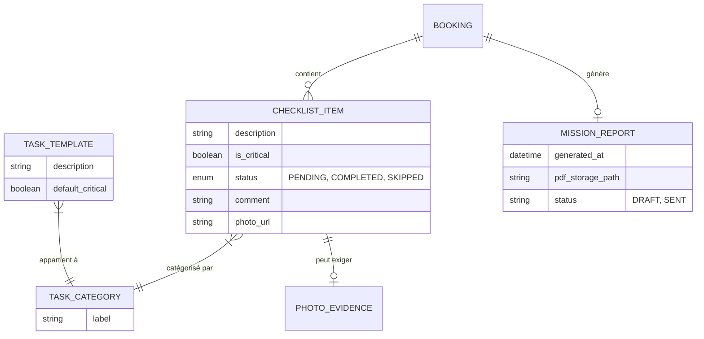
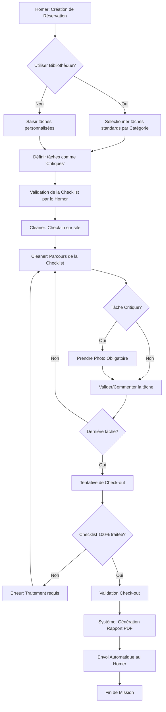

# Analyse Métier : Checklist de Prestation Personnalisée et Rapport de Mission

## 1. Modèle Conceptuel de Données (MCD)

---

## 2. Diagramme de flux (BPMN)

---

## 3. Critères d'Acceptation (Gherkin)

### Scénario 1 : Configuration de la checklist par le Homer
**Given** que je suis un Homer en train de créer une réservation
**When** j'accède à la section "Détails de la prestation"
**Then** le système me propose une liste de tâches pré-définies classées par catégories (Cuisine, Salon, etc.)
**And** je peux ajouter une tâche libre avec une description personnalisée
**And** je peux marquer n'importe quelle tâche comme "Critique"

### Scénario 2 : Obligation de traitement avant Check-out
**Given** que je suis un Cleaner ayant effectué le Check-in
**When** je tente de valider mon "Check-out"
**But** qu'au moins une tâche de la checklist n'a été ni validée ni commentée
**Then** le système bloque la clôture de la mission
**And** m'affiche un message d'erreur indiquant les points restants à traiter

### Scénario 3 : Preuve photo pour tâche critique
**Given** qu'une tâche a été marquée comme "Critique" par le Homer
**When** je sélectionne cette tâche pour la valider dans mon interface Cleaner
**Then** le système doit m'imposer la prise d'une photo via l'application
**And** la validation de la tâche est impossible sans l'ajout de ce média

### Scénario 4 : Génération et transmission du rapport de mission
**Given** qu'une prestation vient d'être clôturée par le "Check-out" du Cleaner
**When** le système finalise la transaction
**Then** un rapport PDF est généré incluant :
  - Le statut de chaque tâche (Validée / Ignorée avec commentaire)
  - Les photos associées aux tâches critiques
  - L'heure précise de début et de fin d'intervention
**And** ce rapport est envoyé par email au Homer et devient consultable dans son historique de réservation