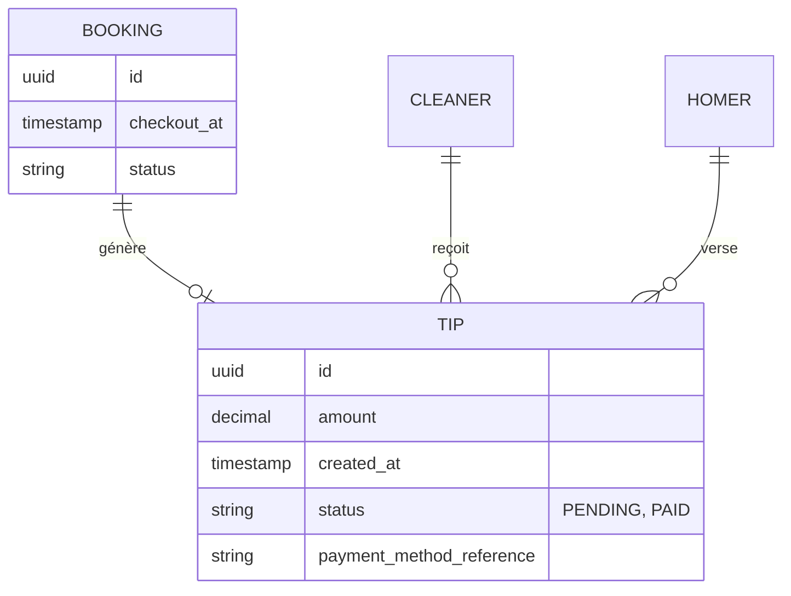
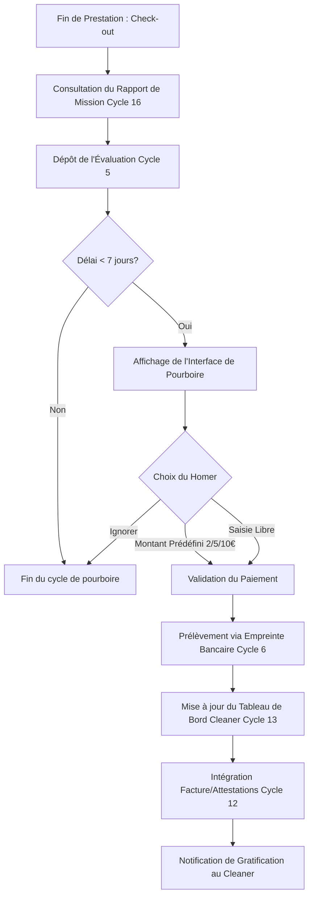

J'analyse les spécifications du système de pourboire pour en extraire la logique métier, les impacts sur le modèle de données et le flux opérationnel.

### Critères d'Acceptation (Gherkin)

**Scénario 1 : Incitation au pourboire après évaluation positive**
*   **Given** un Homer ayant validé le rapport de mission de son Cleaner (Cycle 16)
*   **And** le Homer vient de soumettre une évaluation (Cycle 5)
*   **And** le délai depuis le Check-out est inférieur à 7 jours
*   **When** le Homer termine le processus d'évaluation
*   **Then** l'interface de pourboire s'affiche avec les options 2€, 5€, 10€ et "Montant libre"

**Scénario 2 : Versement d'un pourboire en un clic**
*   **Given** un Homer sur l'interface de pourboire
*   **And** un moyen de paiement est déjà enregistré (Cycle 6)
*   **When** le Homer sélectionne un montant de 5€ et valide
*   **Then** le système déclenche le paiement sans demander de nouvelles coordonnées bancaires
*   **And** le montant total de 5€ est marqué pour reversement intégral au Cleaner (0% commission)

**Scénario 3 : Expiration de la fenêtre de pourboire**
*   **Given** une prestation terminée avec un Check-out datant de plus de 7 jours
*   **When** le Homer consulte le rapport de mission
*   **Then** l'option de verser un pourboire n'est plus proposée

**Scénario 4 : Visibilité et traçabilité**
*   **Given** un pourboire de 10€ versé avec succès
*   **When** le Cleaner consulte son tableau de bord analytique (Cycle 13)
*   **Then** le pourboire apparaît dans une catégorie de revenus distincte des prestations
*   **And** la facture finale (Cycle 12) présente une ligne explicite "Pourboire (Tipping)" de 10€