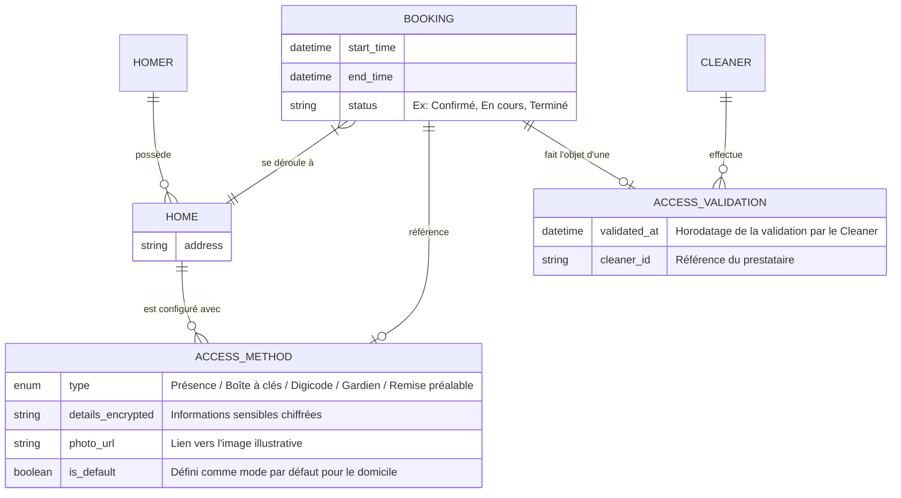
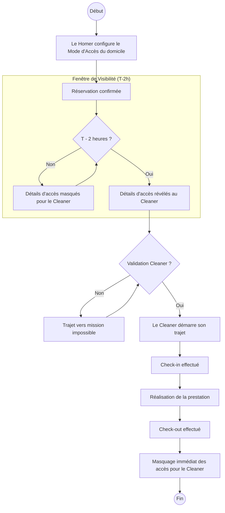

# Spécification Métier : Gestion des Modes d'Accès et Protocoles d'Entrée Sécurisés

## 1. Modèle Conceptuel de Données (MCD)

## 2. Diagramme de flux (BPMN)

## 3. Critères d'Acceptation (Gherkin)

### Scénario 1 : Configuration initiale par le Homer
**Given** un Homer authentifié accédant à la gestion de son domicile.
**When** il sélectionne un mode d'accès (ex: "Boîte à clés").
**And** il saisit le code secret et ajoute une photo de l'emplacement de la boîte.
**Then** les informations sont sauvegardées de manière sécurisée (chiffrement des données sensibles).
**And** ce mode devient le protocole par défaut pour les futures missions.

### Scénario 2 : Révélation conditionnelle des informations (Sécurité)
**Given** une mission avec le statut "Confirmé" débutant à 14h00.
**When** le Cleaner consulte la fiche mission à 11h00.
**Then** les détails du mode d'accès (codes, photo, instructions spécifiques) ne sont pas affichés.
**When** l'heure système atteint 12h01 (T-2h avant début).
**Then** les détails d'accès deviennent visibles sur l'application du Cleaner.

### Scénario 3 : Obligation de validation avant trajet
**Given** un Cleaner ayant accès aux détails d'une mission à moins de 2 heures du début.
**When** il tente de cliquer sur "Démarrer le trajet".
**Then** le système bloque l'action et demande une confirmation de lecture des instructions d'accès.
**When** le Cleaner valide avoir pris connaissance des instructions.
**Then** le bouton "Démarrer le trajet" devient actif.

### Scénario 4 : Protection de la vie privée post-prestation
**Given** une mission dont le "Check-out" a été validé.
**When** le Cleaner retourne sur le détail de la mission passée dans son historique.
**Then** les codes d'accès et photos d'accès sont à nouveau masqués.
**And** un message indique que l'accès est expiré pour des raisons de sécurité.