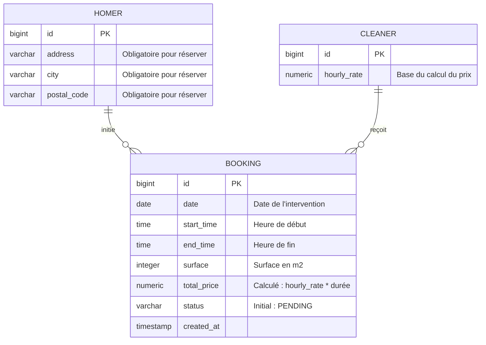
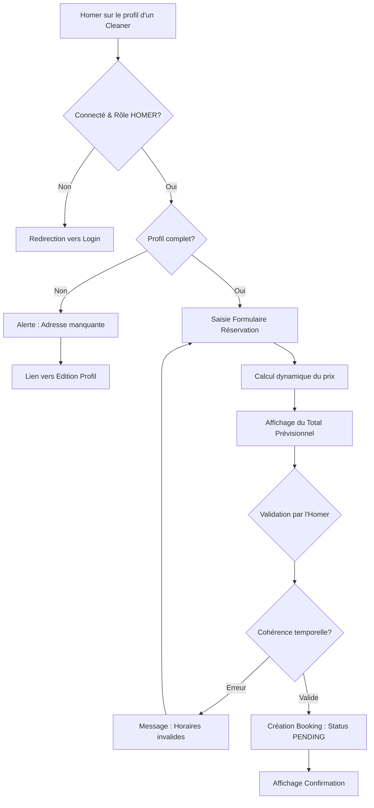

I will begin by researching the current data model and business logic to ensure the new feature is perfectly integrated into the existing ecosystem.

Voici le livrable structuré pour la feature **Réservation d'une Prestation de Ménage**, conforme aux standards de l'analyse métier.

# Analyse Métier : Réservation d'une Prestation de Ménage

## 1. Modèle Conceptuel de Données (MCD) mis à jour
Le modèle inclut la relation pivot entre l'Homer et le Cleaner via l'entité `Booking`.

## 2. Diagramme de Flux (BPMN)
Ce flux décrit le processus nominal et les contrôles de validité avant la persistance.

## 3. Critères d'Acceptation (Gherkin)

### Scénario 1 : Calcul automatique du prix prévisionnel
**Given** un Homer connecté consultant le profil d'un Cleaner ayant un tarif de 20€/h  
**When** l'Homer saisit une intervention de 09:00 à 11:00  
**Then** le système affiche un montant total prévisionnel de 40.00€  

### Scénario 2 : Blocage pour profil incomplet
**Given** un Homer connecté dont l'adresse n'est pas renseignée dans son profil  
**When** il tente d'accéder au formulaire de réservation sur le profil d'un Cleaner  
**Then** le système affiche un message d'erreur indiquant que l'adresse (rue, ville, code postal) est requise pour réserver  
**And** le bouton de validation est désactivé  

### Scénario 3 : Validation de la cohérence temporelle
**Given** un Homer sur le formulaire de réservation  
**When** il saisit une heure de fin (10:00) antérieure ou égale à l'heure de début (11:00)  
**Then** le système empêche la soumission  
**And** un message d'erreur "L'heure de fin doit être postérieure à l'heure de début" s'affiche  

### Scénario 4 : Persistance d'une demande valide
**Given** un Homer avec un profil complet et des données de réservation valides  
**When** il clique sur "Confirmer la réservation"  
**Then** une nouvelle entrée est créée dans la base de données avec le statut "PENDING"  
**And** l'Homer reçoit une confirmation visuelle du succès de sa demande