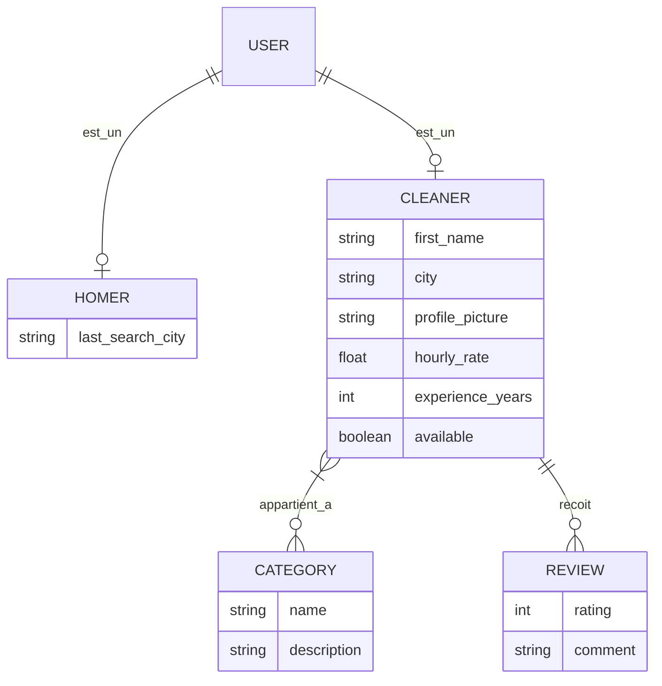
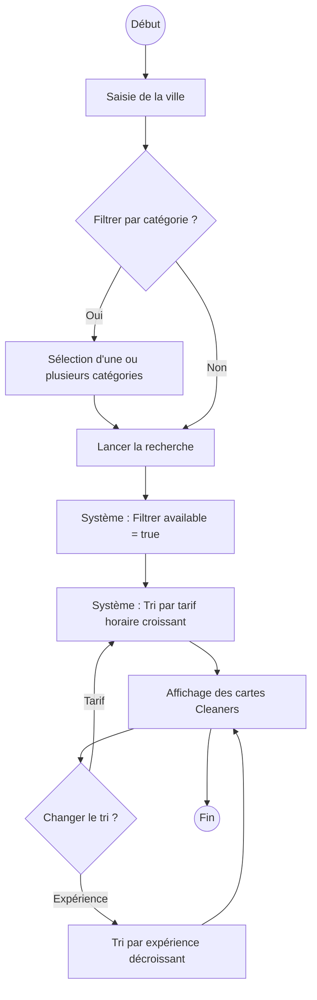

# Spécifications Fonctionnelles : Moteur de recherche et filtrage des Cleaners

## 1. Modèle Conceptuel de Données (MCD)

## 2. Diagramme de flux (BPMN)

## 3. Critères d'Acceptation

### Scénario 1 : Recherche nominale par ville
**Given** un Homer connecté sur la page de recherche  
**When** il saisit la ville "Paris"  
**Then** le système affiche uniquement les Cleaners dont le champ `city` est "Paris"  
**And** le système exclut automatiquement tous les Cleaners dont `available` est `false`  
**And** les résultats sont triés par `hourly_rate` du moins cher au plus cher.

### Scénario 2 : Filtrage par catégories multiples
**Given** une liste de résultats pour la ville "Lyon"  
**When** le Homer sélectionne les catégories "Repassage" et "Nettoyage Vitres"  
**Then** le système affiche uniquement les Cleaners liés à au moins une de ces deux catégories  
**And** les critères de disponibilité (available = true) restent appliqués.

### Scénario 3 : Changement de l'ordre de tri
**Given** une liste de résultats affichée  
**When** le Homer sélectionne l'option de tri "Expérience"  
**Then** la liste est réorganisée pour afficher les Cleaners ayant le plus grand nombre de `experience_years` en premier.

### Scénario 4 : Intégrité des informations affichées
**Given** un résultat de recherche affiché sous forme de carte  
**Then** la carte doit obligatoirement présenter :
- Le `first_name` du Cleaner
- La `profile_picture`
- La `city`
- Le `hourly_rate`
- La note moyenne (moyenne arithmétique des `rating` de la table `reviews` liée).

### Scénario 5 : Aucun résultat trouvé
**Given** un Homer effectuant une recherche dans une ville sans prestataires disponibles  
**When** il valide sa recherche  
**Then** le système affiche un message explicite : "Aucun Cleaner disponible dans cette zone pour le moment".