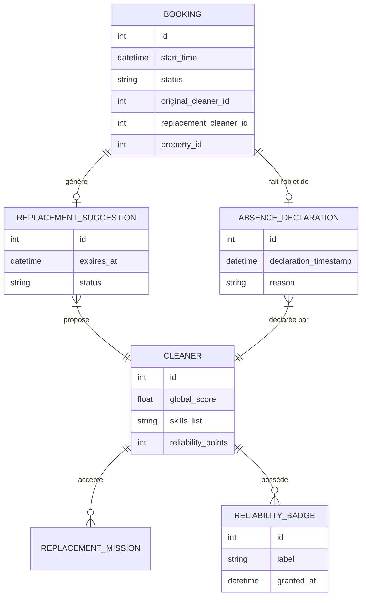
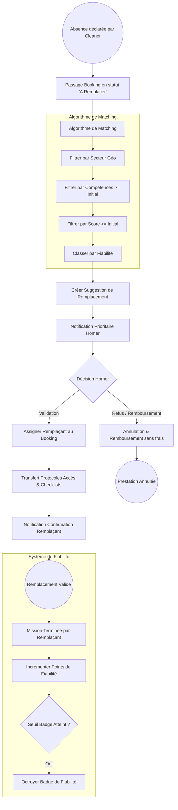

# Spécifications Métier : Gestion des Remplacements et Continuité de Service

## 1. Modèle Conceptuel de Données (MCD)

---

## 2. Diagramme de Flux (BPMN)

---

## 3. Critères d'Acceptation

### SCÉNARIO 1 : Déclenchement automatique de la recherche de remplacement
**Given** Une prestation confirmée prévue pour un logement (Cycle 19).
**When** Le Cleaner initial déclare une indisponibilité via l'interface.
**Then** Le statut de la prestation devient "En attente de remplacement".
**And** Le système identifie les Cleaners qui :
1. Sont disponibles sur le créneau horaire.
2. Sont dans le même secteur géographique.
3. Ont un score (Cycle 5) supérieur ou égal au Cleaner initial.
4. Possèdent les compétences requises (Cycle 1) pour cette prestation.

### SCÉNARIO 2 : Proposition et Validation par le Homer
**Given** Une suggestion de remplacement générée par l'algorithme.
**When** Le Homer reçoit la notification et consulte le profil du remplaçant suggéré.
**Then** Le Homer peut accepter le profil proposé.
**And** En cas d'acceptation, les données suivantes sont rendues accessibles au remplaçant pour cette mission spécifique :
- Le protocole d'accès sécurisé (Cycle 18).
- La checklist personnalisée du logement (Cycle 16).

### SCÉNARIO 3 : Refus et Remboursement
**Given** Une suggestion de remplacement envoyée au Homer.
**When** Le Homer refuse le remplaçant proposé ou demande explicitement un remboursement.
**Then** La prestation est annulée.
**And** Un remboursement intégral (100%) est déclenché automatiquement sans frais d'annulation pour le Homer.

### SCÉNARIO 4 : Attribution du Badge de Fiabilité
**Given** Un Cleaner ayant accepté et réalisé une mission de remplacement de dernière minute (moins de 24h avant le début).
**When** La prestation est marquée comme "Terminée".
**Then** Le Cleaner reçoit des points de fiabilité bonus.
**And** Si le total des points franchit le seuil défini, le "Badge de Fiabilité" est affiché sur son profil public.