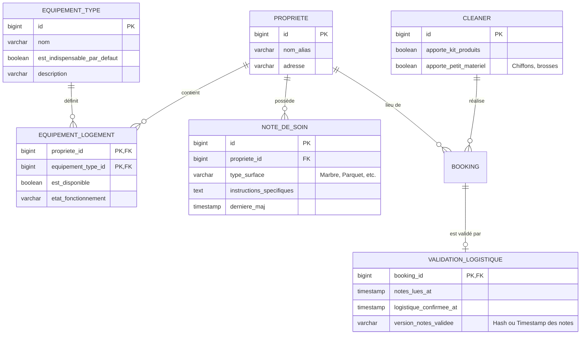
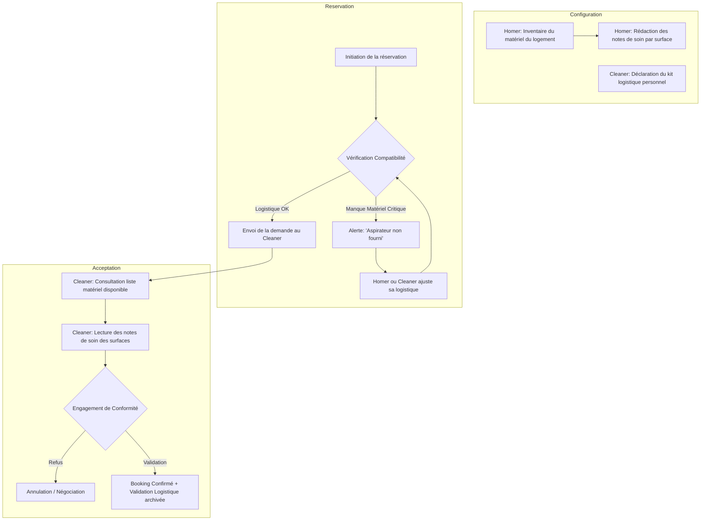

I will begin by researching the current state of the database and architecture to ensure the updated Business Analyst models are consistent with existing entities.

I will read the description of Cycle 19 in the backlog to confirm the structure of the `logements` table and its relationship with `homers`, ensuring the new logistics features are correctly integrated.

I will examine `sweet-home-app/sweethome-postgres/schema.sql` to confirm the exact name and structure of the `logements` table, ensuring the new models are built on accurate technical foundations.

Voici l'analyse métier pour la feature **[Gestion de la Logistique Matérielle et des Produits d'Entretien]**.

### 1. Modèle Conceptuel de Données (MCD) mis à jour
Ce modèle intègre la gestion des équipements par logement, les notes de soin spécifiques et les capacités logistiques des Cleaners.

---

### 2. Diagramme de flux BPMN
Processus de sécurisation logistique de la réservation, de la configuration au closing de l'acceptation.

---

### 3. Critères d'Acceptation (Given/When/Then)

#### Scénario 1 : Inventaire du matériel par le Homer
**Given** un Homer connecté sur sa page "Ma Propriété"
**When** il sélectionne "Aspirateur" dans la liste des équipements disponibles et enregistre
**Then** l'équipement est marqué comme "Fourni par le propriétaire" pour toutes les futures missions dans ce logement.

#### Scénario 2 : Alerte de compatibilité logistique
**Given** un logement où aucun "Aspirateur" n'est déclaré disponible
**And** un Cleaner dont le profil indique qu'il n'apporte pas de gros matériel
**When** le Homer tente de réserver ce Cleaner pour ce logement
**Then** le système affiche un message d'avertissement : "Attention : Aucun aspirateur n'est disponible pour cette mission."
**And** le système bloque la confirmation tant que l'un des deux ne s'engage pas à le fournir.

#### Scénario 3 : Prise de connaissance des notes de soin
**Given** un logement ayant une note de soin pour une surface "Marbre" (Instruction : "Utiliser uniquement du savon noir")
**When** un Cleaner reçoit une demande de réservation pour ce logement
**Then** il doit obligatoirement ouvrir l'onglet "Spécificités de surfaces"
**And** il doit cocher la case "Je certifie avoir lu et compris les consignes de soin" pour pouvoir cliquer sur "Accepter la mission".

#### Scénario 4 : Mise à jour du profil logistique Cleaner
**Given** un Cleaner souhaitant proposer une prestation "Tout inclus"
**When** il coche l'option "J'apporte mon propre kit de produits d'entretien" dans ses paramètres
**Then** son profil affiche un badge "Produits fournis"
**And** le système ne génère plus d'alerte sur l'absence de produits d'entretien lors des réservations.