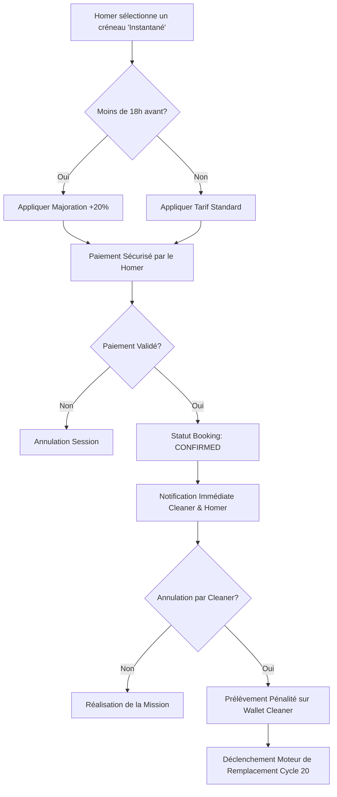

# Spécifications Fonctionnelles : Système de Réservation Instantanée et Missions "Express"

## 1. Modèle Conceptuel de Données (MCD) mis à jour

```mermaid
classDiagram
    class Cleaner {
        +Boolean is_kyc_verified
        +Float average_rating
        +Float acceptance_rate
        +Boolean instant_booking_enabled
        +checkEligibility() Boolean
    }

    class Availability {
        +DateTime start_time
        +DateTime end_time
        +Boolean is_explicitly_available
    }

    class Booking {
        +Enum status {PENDING, CONFIRMED, CANCELLED, COMPLETED}
        +Boolean is_instant
        +Boolean is_express
        +Decimal base_price
        +Decimal surge_multiplier
        +Decimal final_price
        +DateTime created_at
    }

    class Wallet {
        +Decimal balance
        +processPenalty(amount)
    }

    Cleaner "1" -- "*" Availability : declares
    Cleaner "1" -- "*" Booking : receives
    Homer "1" -- "*" Booking : creates
    Booking "1" -- "1" Payment : requires
    Cleaner "1" -- "1" Wallet : owns
```

## 2. Diagramme de flux BPMN (Processus de Réservation)



## 3. Critères d'Acceptation (Given/When/Then)

### Scénario 1 : Éligibilité à l'activation du mode Instantané
**Given** Un Cleaner avec un profil "Vérifié" (KYC validé)
**And** Sa note moyenne est de 4.9/5
**And** Son taux d'acceptation est jugé "Exemplaire" par le système
**When** Le Cleaner tente d'activer l'option "Réservation Instantanée" dans ses paramètres
**Then** Le système autorise l'activation du mode.

### Scénario 2 : Réservation Standard (Hors Urgence)
**Given** Un Homer consultant le profil d'un Cleaner éligible (Instant Booking actif)
**And** Un créneau disponible dans plus de 18 heures
**When** Le Homer valide le paiement de la prestation
**Then** Le statut de la réservation passe immédiatement à `CONFIRMED`
**And** Aucune majoration tarifaire n'est appliquée.

### Scénario 3 : Mission "Express" avec Tarification Dynamique
**Given** Un Homer consultant un créneau disponible commençant dans 12 heures (Urgence < 18h)
**When** Le Homer sélectionne ce créneau pour une réservation instantanée
**Then** Le système calcule automatiquement une majoration de 20% sur le tarif de base
**And** Le statut passe à `CONFIRMED` dès la validation du paiement.

### Scénario 4 : Annulation par le Cleaner et Pénalité
**Given** Une réservation confirmée via le mode "Instantané"
**When** Le Cleaner annule la mission (hors cas de force majeure)
**Then** Le système prélève automatiquement une pénalité financière sur le `Wallet` du Cleaner
**And** Le moteur de remplacement est immédiatement alerté pour trouver un nouveau prestataire.

### Scénario 5 : Restriction de visibilité
**Given** Un Cleaner ayant une note de 4.2/5
**When** Un Homer recherche des Cleaners en mode "Réservation Instantanée"
**Then** Ce Cleaner n'apparaît pas dans les résultats filtrés pour ce mode, même s'il a des disponibilités.