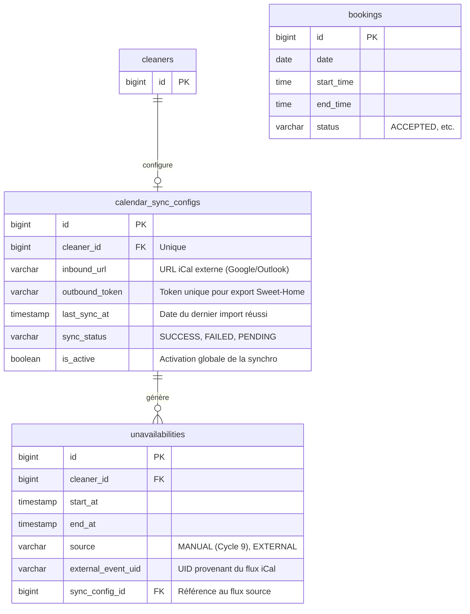

Voici le livrable métier structuré pour la feature **"Système de Synchronisation Calendrier Externe (Google/iCal)"**.

### 1. Modèle Conceptuel de Données (MCD) mis à jour

Ce diagramme intègre la configuration de synchronisation et étend l'entité `unavailabilities` introduite au Cycle 9.



---

### 2. Diagramme de flux BPMN

Le diagramme détaille les deux flux : l'exportation (Sortant) et l'importation automatisée (Entrant).

```mermaid
graph TD
    %% Flux de Configuration
    subgraph "Configuration (Cleaner)"
        A1[Dashboard : Onglet Calendrier] --> A2[Générer lien d'exportation iCal]
        A2 --> A3[Copier lien vers Google/Outlook/Apple]
        A1 --> A4[Saisir URL iCal externe]
        A4 --> A5[Déclencher première synchronisation]
    end

    %% Flux d'Importation (Background Job)
    subgraph "Synchronisation Entrante (Background Job / Manuel)"
        B1[Déclencheur : Cron Job ou Bouton Manuel] --> B2[Récupérer URL de 'calendar_sync_configs']
        B2 --> B3[Fetch du fichier .ics distant]
        B3 --> B4{Lecture des événements}
        B4 --> B5[Filtrage : Uniquement créneaux futurs]
        B5 --> B6[Anonymisation : Titre = 'Occupé (Sync)']
        B6 --> B7[Upsert dans 'unavailabilities' : source=EXTERNAL]
        B7 --> B8[Suppression des anciens créneaux EXTERNAL absents du flux]
        B8 --> B9[Mise à jour 'last_sync_at']
    end

    %% Flux d'Exportation (Requête externe)
    subgraph "Exportation Sortante (Requête iCal)"
        C1[Calendrier Externe : Requête URL avec Token] --> C2[Vérifier validité Token]
        C2 -->|Invalide| C3[Retourner 404/403]
        C2 -->|Valide| C4[Récupérer Bookings ACCEPTED du Cleaner]
        C4 --> C5[Convertir Bookings en format VEVENT iCal]
        C5 --> C6[Retourner flux .ics]
    end
```

---

### 3. Critères d'Acceptation (Given/When/Then)

#### CA 1 : Génération du flux sortant (Export)
*   **Given** Un Cleaner avec des réservations confirmées (`ACCEPTED`) sur Sweet-Home.
*   **When** Il active l'exportation dans ses paramètres.
*   **Then** Le système génère une URL unique et sécurisée contenant un token.
*   **Then** L'accès à cette URL via un outil tiers (ex: Google Calendar) affiche les réservations Sweet-Home comme des événements occupés.

#### CA 2 : Configuration du flux entrant (Import)
*   **Given** Un Cleaner possédant un calendrier Google Calendar.
*   **When** Il renseigne l'URL iCal "secrète" de son Google Calendar dans son profil Sweet-Home.
*   **Then** Le système valide le format de l'URL et enregistre la configuration.
*   **Then** Une première synchronisation est lancée pour importer les événements futurs.

#### CA 3 : Respect de la vie privée (Import)
*   **Given** Un événement personnel dans le calendrier externe intitulé "Rendez-vous Dentiste - 14h".
*   **When** Cet événement est synchronisé vers Sweet-Home.
*   **Then** L'indisponibilité créée en base de données ne contient aucune mention du titre ou du lieu original.
*   **Then** Seules les heures de début et de fin sont stockées pour bloquer les réservations des Homers.

#### CA 4 : Blocage automatique des réservations
*   **Given** Un créneau "Occupé" importé via iCal le Lundi de 10h à 12h.
*   **When** Un Homer tente de réserver une mission le même Lundi à 10h30.
*   **Then** Le créneau est affiché comme indisponible et la réservation est impossible.

#### CA 5 : Rafraîchissement et nettoyage
*   **Given** Un Cleaner supprimant un événement dans son calendrier Google Calendar.
*   **When** Le background job de synchronisation s'exécute (ou suite à un clic sur "Synchroniser maintenant").
*   **Then** L'indisponibilité correspondante dans `unavailabilities` (sourcée EXTERNAL) est supprimée de Sweet-Home.
*   **Then** Le créneau redevient disponible pour les Homers (si une disponibilité récurrente existe).