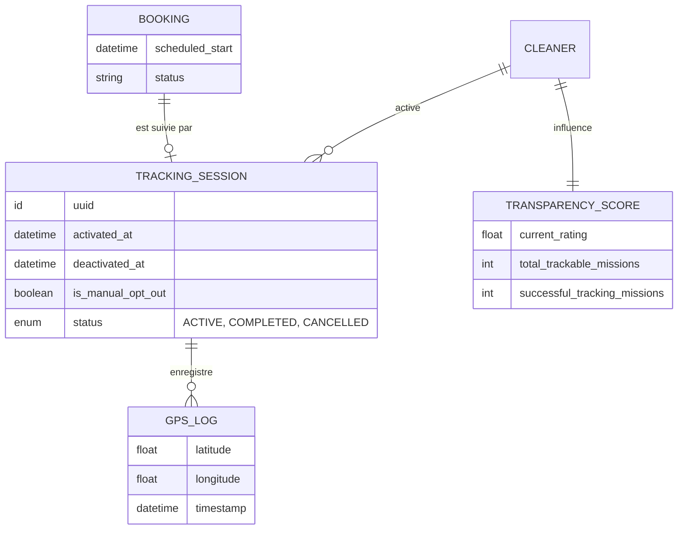
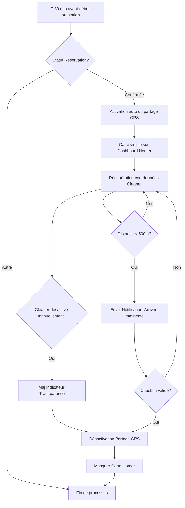

# Système de Suivi de l'Arrivée du Prestataire en Temps Réel (Live Tracking)

## 1. Modèle Conceptuel de Données (MCD)

## 2. Diagramme de flux (BPMN)

## 3. Critères d'Acceptation (Gherkin)

### Scénario 1 : Activation automatique du suivi
**Given** une réservation confirmée prévue à 14h00
**And** il est actuellement 13h30 (T-30 min)
**When** le système déclenche la fenêtre de suivi
**Then** la session de tracking doit passer au statut "ACTIVE"
**And** l'Homer doit voir apparaître le composant "Live Tracking" sur son tableau de bord.

### Scénario 2 : Notification de proximité (Geofencing)
**Given** une session de tracking active pour un Cleaner
**And** la position GPS du Cleaner est à plus de 500 mètres du domicile de l'Homer
**When** les coordonnées GPS du Cleaner entrent dans un rayon inférieur ou égal à 500 mètres
**Then** une notification push "Arrivée Imminente" est envoyée instantanément à l'Homer.

### Scénario 3 : Fin de suivi sur Check-in
**Given** une session de tracking active
**When** le Cleaner valide son "Check-in" via l'application pour débuter sa mission
**Then** la session de tracking doit passer immédiatement au statut "COMPLETED"
**And** l'accès aux coordonnées GPS du Cleaner doit être révoqué
**And** la carte doit disparaître du tableau de bord de l'Homer.

### Scénario 4 : Désactivation manuelle et impact sur la transparence
**Given** une session de tracking active
**When** le Cleaner choisit de désactiver manuellement le partage de position
**Then** le flux de données GPS s'interrompt immédiatement
**And** le système doit décrémenter le ratio de missions suivies dans le "Transparency Score" du Cleaner.