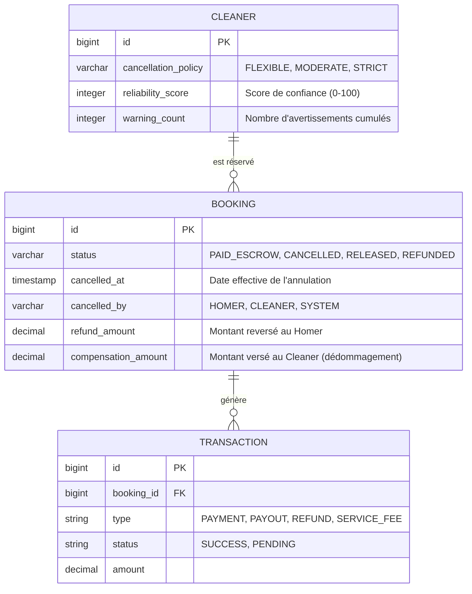
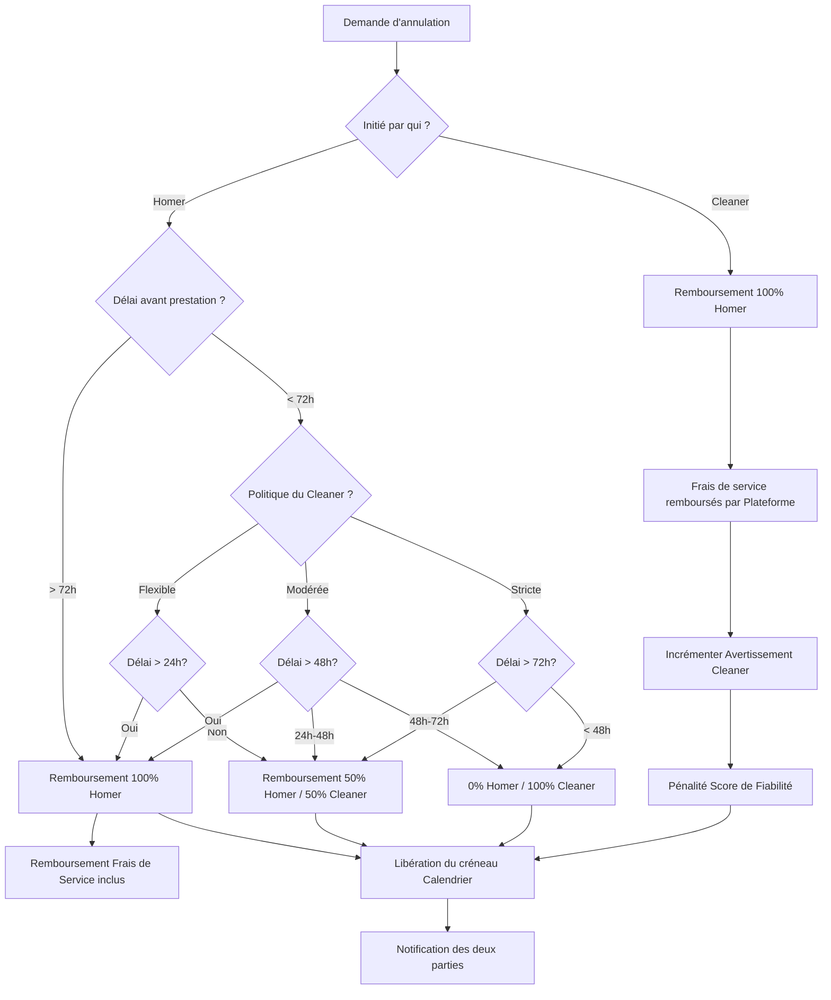

J'analyse les documents existants pour comprendre l'état actuel du modèle de données et des processus de réservation et de paiement, afin d'intégrer la gestion des annulations de manière cohérente.

J'examine les spécifications du Cycle 6 concernant le paiement sécurisé afin de m'assurer que la politique d'annulation s'intègre correctement au système de séquestre et de remboursement existant.

Je consulte le backlog pour confirmer les détails de la feature "Gestion des Annulations et Politique de Remboursement" et m'assurer de la cohérence avec les cycles précédents.

J'analyse les spécifications du Cycle 9 pour comprendre le fonctionnement actuel de la gestion des créneaux dans le calendrier, afin de garantir que l'annulation libère correctement les disponibilités du Cleaner.

Voici le dossier de conception fonctionnelle structuré pour la feature **"Gestion des Annulations et Politique de Remboursement"**. Ce document définit les règles contractuelles et les flux automatisés pour sécuriser les transactions entre Homers et Cleaners.

### 1. Modèle Conceptuel de Données (MCD) mis à jour

Le schéma intègre désormais la configuration de la politique d'annulation pour les Cleaners et le suivi des annulations dans les réservations.

---

### 2. Diagramme de flux BPMN

Ce diagramme décrit la logique de calcul et de déclenchement des flux financiers lors d'une annulation.

---

### 3. Critères d'Acceptation (Given/When/Then)

#### CA 1 : Paramétrage de la politique par le Cleaner
*   **Given** Un Cleaner accédant à la configuration de son profil.
*   **When** Il choisit le niveau "Modérée" pour sa politique d'annulation.
*   **Then** Toutes ses nouvelles réservations seront soumises aux règles de remboursement associées (100% > 48h, 50% [24h-48h], 0% < 24h).
*   **And** La politique choisie est affichée clairement sur son profil public pour les Homers.

#### CA 2 : Annulation par le Homer (Délai respecté)
*   **Given** Une réservation `PAID_ESCROW` prévue dans 5 jours (> 72h).
*   **When** Le Homer clique sur "Annuler la réservation".
*   **Then** Le système déclenche un remboursement intégral (`REFUND`) du prix de la prestation ET des frais de service.
*   **Then** Le statut du Booking passe à `CANCELLED`.
*   **And** Le créneau horaire redevient disponible dans le calendrier du Cleaner.

#### CA 3 : Annulation par le Homer (Indemnisation Cleaner)
*   **Given** Une réservation sous politique "Stricte" prévue dans 36 heures.
*   **When** Le Homer annule la réservation.
*   **Then** Le système calcule 0% de remboursement pour le Homer (car < 48h en Strict).
*   **Then** La somme séquestrée (hors frais de service) est versée au Cleaner à titre de dédommagement (`PAYOUT`).
*   **And** Sweet-Home conserve les frais de service de la plateforme.

#### CA 4 : Annulation par le Cleaner (Protection Homer)
*   **Given** Une réservation confirmée quel que soit le délai restant.
*   **When** Le Cleaner annule la prestation depuis son dashboard.
*   **Then** Le Homer est remboursé à 100% immédiatement (y compris les frais de service).
*   **Then** Le Cleaner reçoit un avertissement automatique (`warning_count + 1`).
*   **Then** Si le Cleaner annule moins de 24h avant, une pénalité supplémentaire est appliquée sur son `reliability_score`.

#### CA 5 : Libération automatique du calendrier
*   **Given** Une réservation occupant le créneau "Lundi 14:00 - 16:00".
*   **When** L'annulation est validée par le système (quel que soit l'initiateur).
*   **Then** L'indisponibilité liée à ce `booking_id` est supprimée.
*   **Then** Le Cleaner redevient "Disponible" et réservable pour ce créneau spécifique dans les résultats de recherche.