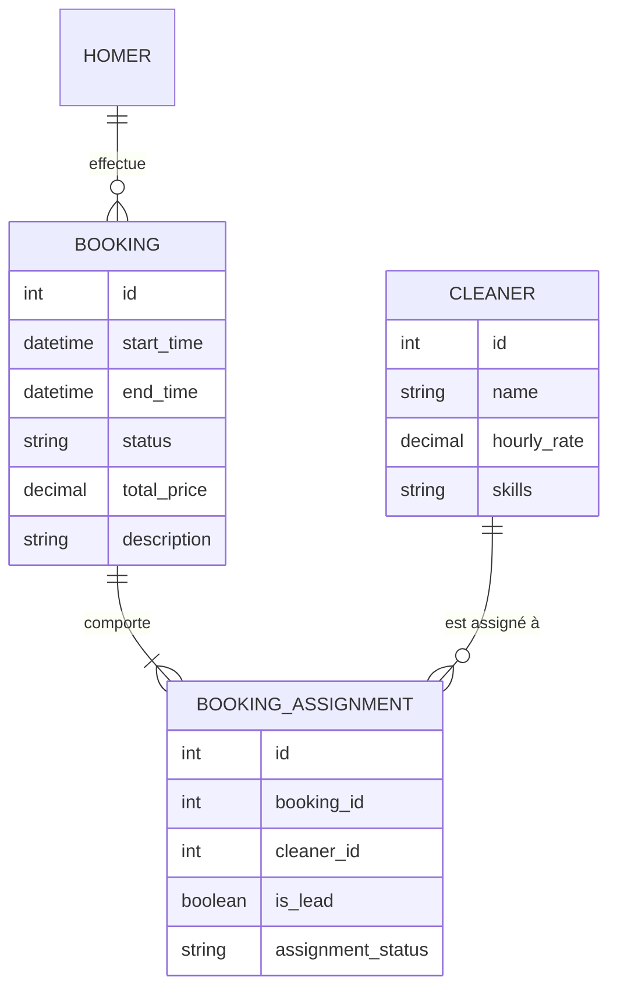
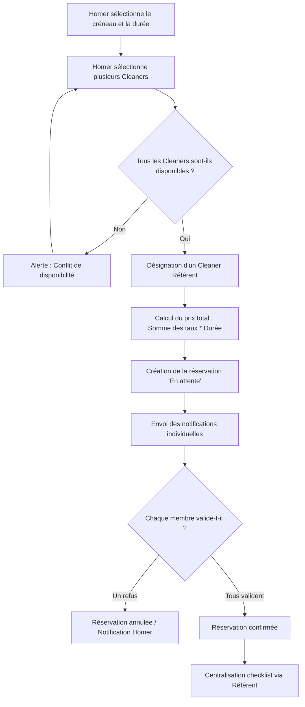

Il s'agit d'une évolution majeure du système de réservation pour permettre la gestion d'équipes. Voici les spécifications métiers structurées pour cette fonctionnalité.

### 1. Modèle Conceptuel de Données (MCD) - Mis à jour

### 2. Diagramme de Flux (BPMN)

### 3. Critères d'Acceptation (Given/When/Then)

#### Scénario 1 : Calcul du prix multi-prestataires
**Given** un Homer souhaitant réserver une prestation de 2 heures
**And** un Cleaner A avec un tarif de 20€/h
**And** un Cleaner B avec un tarif de 25€/h
**When** le Homer sélectionne le Cleaner A et le Cleaner B pour la mission
**Then** le système doit calculer un prix total de 90€ `((20 + 25) * 2)`
**And** le système doit désigner l'un des deux comme "Référent" par défaut.

#### Scénario 2 : Vérification de disponibilité croisée
**Given** un Cleaner A déjà réservé de 14h à 16h
**And** un Cleaner B disponible toute la journée
**When** un Homer tente de réserver une équipe composée de A et B pour 15h
**Then** le système doit bloquer la réservation
**And** afficher un message indiquant que le Cleaner A n'est pas disponible sur ce créneau.

#### Scénario 3 : Validation individuelle obligatoire
**Given** une réservation d'équipe créée avec 3 Cleaners
**When** deux Cleaners acceptent la mission mais le troisième la refuse
**Then** le statut de la réservation globale passe à "Annulée" ou "À reconfigurer"
**And** le Homer est notifié qu'un des prestataires a décliné, rendant l'équipe incomplète.

#### Scénario 4 : Rôle du Référent (Lead)
**Given** une réservation d'équipe confirmée
**When** la mission commence
**Then** seul le "Cleaner Référent" a l'autorité pour valider la checklist finale
**And** les communications centralisées (chat/instructions) sont dirigées prioritairement vers le Référent.