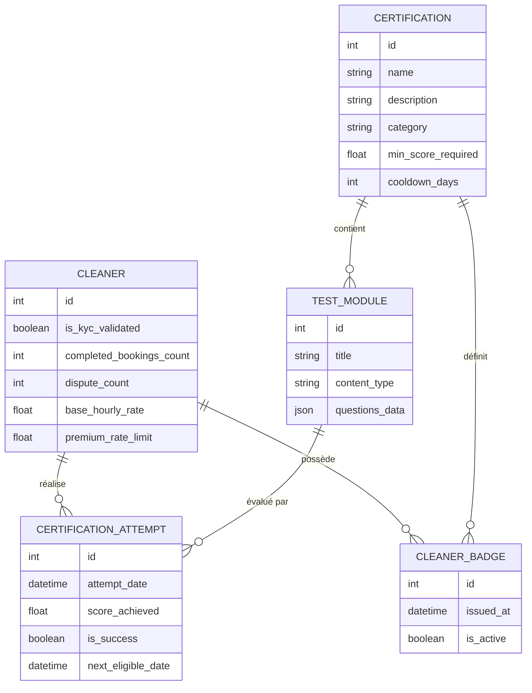
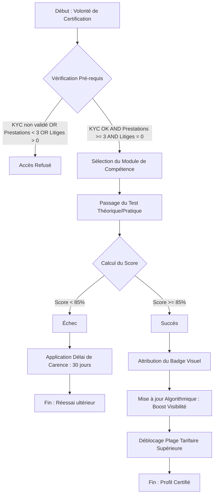

Je vais analyser la demande pour la feature "Certification des Compétences et Tests de Validation Techniques" et produire les livrables métier demandés : le MCD, le flux BPMN et les Critères d'Acceptation.

### 1. Modèle Conceptuel de Données (MCD) - Mermaid.js

### 2. Diagramme de flux (BPMN) - Mermaid.js

### 3. Critères d'Acceptation (Gherkin)

#### Scénario 1 : Éligibilité au passage d'une certification
**Given** un Cleaner authentifié sur la plateforme  
**And** son KYC a été validé (Cycle 7)  
**And** il a réalisé au moins 3 prestations terminées sans aucun litige  
**When** il consulte la section "Certifications et Badges"  
**Then** il doit pouvoir visualiser la liste des modules de test disponibles  
**And** il doit pouvoir initier un test de compétence.

#### Scénario 2 : Obtention réussie d'une certification
**Given** un Cleaner éligible passant le test "Repassage de précision"  
**When** il soumet ses réponses et obtient un score de 90%  
**Then** le système enregistre le succès de la tentative  
**And** un badge "Vérifié par Sweet-Home : Repassage" est ajouté à son profil  
**And** son profil reçoit un boost immédiat dans les résultats de recherche  
**And** le Cleaner est autorisé à augmenter son tarif horaire au-delà de la moyenne locale.

#### Scénario 3 : Échec et période de carence
**Given** un Cleaner passant le test "Produits éco-responsables"  
**When** il obtient un score de 70% (inférieur au seuil de 85%)  
**Then** le badge ne lui est pas attribué  
**And** le système lui interdit de repasser ce test spécifique pendant les 30 prochains jours  
**And** un message lui indique sa date de prochaine éligibilité.

#### Scénario 4 : Filtrage des profils certifiés par le Homer
**Given** un Homer effectuant une recherche de Cleaner  
**When** il active le filtre de recherche "Profils Certifiés uniquement"  
**Then** seuls les Cleaners possédant au moins un badge de certification actif doivent apparaître dans la liste des résultats  
**And** ces profils doivent être affichés en priorité (boost algorithmique).