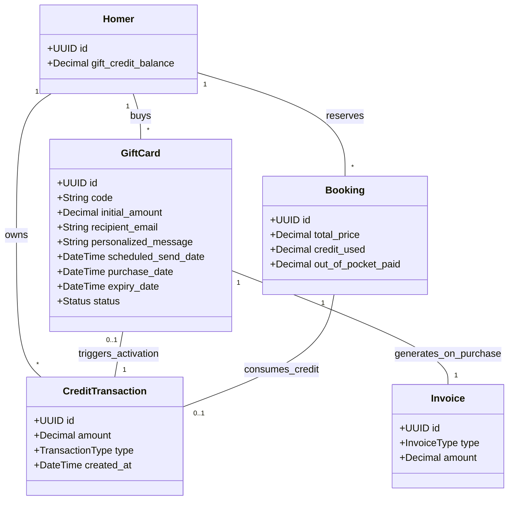
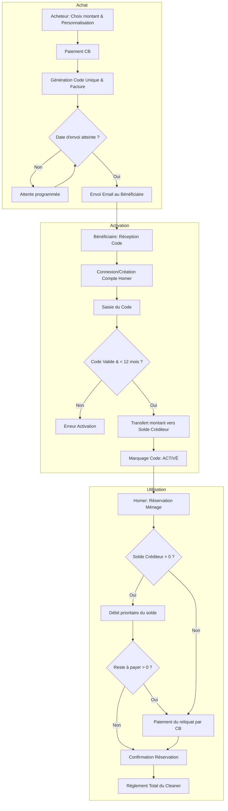

Compte tenu des règles métier du système de cartes cadeaux Sweet-Home, voici les spécifications fonctionnelles structurées pour les équipes techniques.

### 1. Modèle Conceptuel de Données (MCD)
Ce diagramme intègre les nouvelles entités nécessaires à la gestion du cycle de vie des cartes cadeaux et du solde créditeur.

### 2. Diagramme de Flux (BPMN)
Ce flux décrit le cycle de vie complet, de l'achat à l'utilisation finale du crédit.

### 3. Critères d'Acceptation (Gherkin)

#### Scénario 1 : Achat d'une carte cadeau avec montant libre
**Given** un utilisateur connecté sur la page "Offrir une carte"  
**When** il saisit un montant de "45€" (supérieur au minimum de 30€)  
**And** il renseigne l'email du bénéficiaire et un message  
**And** il valide le paiement  
**Then** une `GiftCard` est créée avec le statut `PENDING`  
**And** une facture d'achat de crédit est générée pour l'acheteur  
**And** le code généré est alphanumérique et unique.

#### Scénario 2 : Activation du crédit par le bénéficiaire
**Given** un bénéficiaire possédant un code cadeau de "100€" valide  
**When** il saisit ce code dans son espace "Mon Solde"  
**Then** son `gift_credit_balance` est incrémenté de 100€  
**And** le code devient inutilisable  
**And** une `CreditTransaction` de type `CREDIT` est enregistrée.

#### Scénario 3 : Utilisation fractionnée du crédit pour une réservation
**Given** un utilisateur "Homer" avec un solde de "80€"  
**When** il réserve une prestation de "50€"  
**Then** le système applique une réduction de "50€" sur le montant à payer par CB  
**And** le nouveau solde de l'utilisateur devient "30€"  
**And** la réservation est confirmée sans débit bancaire.

#### Scénario 4 : Expiration de la carte cadeau
**Given** une carte cadeau achetée le 01/01/2024  
**When** un utilisateur tente de l'activer le 02/01/2025  
**Then** le système refuse l'activation pour motif "Code expiré"  
**And** aucun crédit n'est ajouté au compte.

#### Scénario 5 : Paiement mixte (Crédit + CB)
**Given** un utilisateur "Homer" avec un solde de "20€"  
**When** il réserve une prestation de "60€"  
**Then** le système débite les "20€" de son solde  
**And** le système demande un paiement CB de "40€" pour compléter la transaction  
**And** le Cleaner reçoit l'ordre de mission pour une valeur totale de "60€".