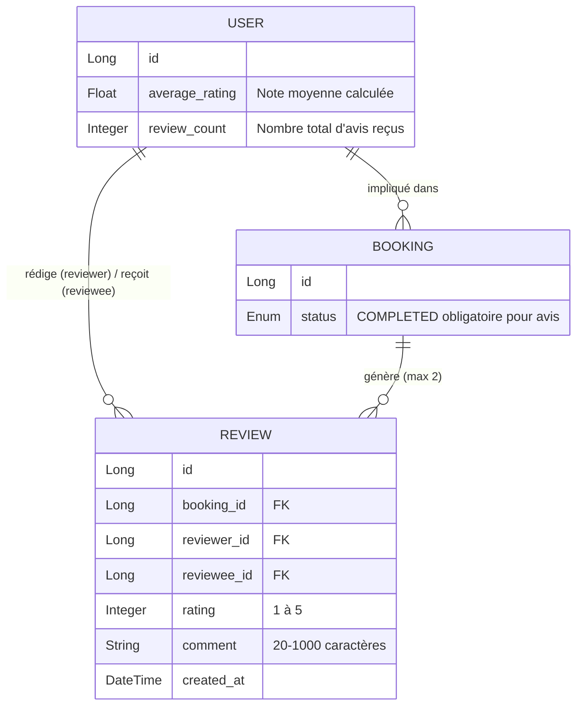
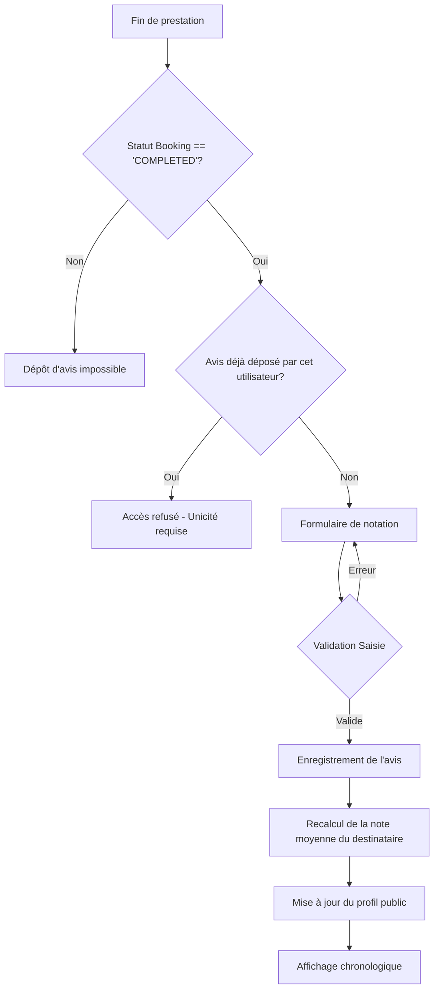

Voici la spécification métier structurée pour le **Système d'Avis et de Notation**, prête pour l'implémentation technique.

### 1. Modèle Conceptuel de Données (MCD)

### 2. Diagramme de Flux (BPMN)

### 3. Critères d'Acceptation (Given/When/Then)

#### Scénario 1 : Dépôt d'un avis valide (Homer vers Cleaner)
*   **Given** Une réservation `B1` entre le Homer `H` et le Cleaner `C`.
*   **Given** Le statut de la réservation `B1` est `COMPLETED`.
*   **Given** Le Homer `H` n'a pas encore déposé d'avis pour `B1`.
*   **When** Le Homer `H` soumet une note de `5` et le commentaire `"Superbe travail, très méticuleux et professionnel."`.
*   **Then** L'avis est enregistré avec succès.
*   **Then** La note moyenne du Cleaner `C` est immédiatement mise à jour.

#### Scénario 2 : Tentative d'avis sur une réservation non terminée
*   **Given** Une réservation `B2` dont le statut est `CONFIRMED` ou `IN_PROGRESS`.
*   **When** L'utilisateur tente d'accéder au formulaire d'avis pour `B2`.
*   **Then** Le système bloque l'action et affiche un message d'erreur d'éligibilité.

#### Scénario 3 : Non-respect des contraintes de saisie (Commentaire trop court)
*   **Given** Une réservation `B1` terminée.
*   **When** L'utilisateur soumet une note de `4` avec le commentaire `"Très bien."` (10 caractères).
*   **Then** Le système rejette la soumission.
*   **Then** Un message d'erreur indique que le commentaire doit contenir au moins 20 caractères.

#### Scénario 4 : Prévention de l'auto-notation
*   **Given** Une réservation `B1` terminée.
*   **When** L'utilisateur tente de soumettre un avis où `reviewer_id` est identique à `reviewee_id`.
*   **Then** Le système rejette la transaction pour violation d'intégrité.

#### Scénario 5 : Unicité de l'avis par partie
*   **Given** Un avis a déjà été déposé par le Cleaner `C` pour la réservation `B1`.
*   **When** Le Cleaner `C` tente de soumettre un second avis pour cette même réservation `B1`.
*   **Then** Le système refuse la soumission au titre de la règle d'unicité.