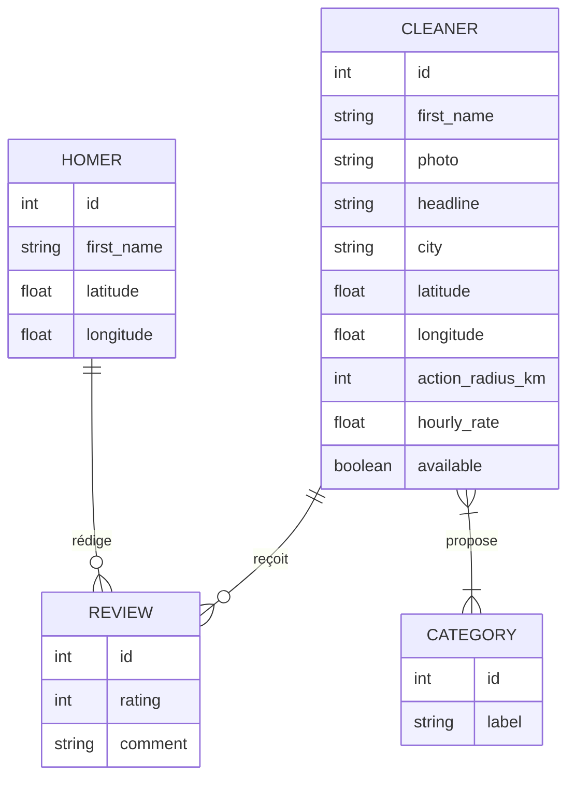
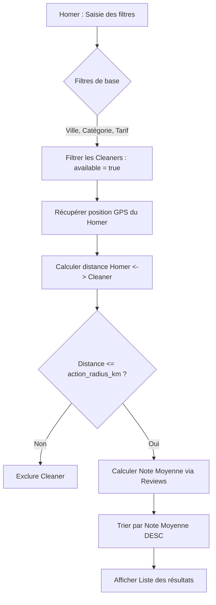

Voici la traduction métier structurée pour la fonctionnalité **Moteur de recherche et filtrage des Cleaners**, conçue pour être exploitée directement par les agents de développement et d'architecture.

---

### 1. Modèle Conceptuel de Données (MCD)
Ce diagramme met en évidence les relations nécessaires au fonctionnement du moteur de recherche, incluant la géolocalisation et les agrégations de notes.

---

### 2. Diagramme de flux (BPMN)
Logique de traitement de la recherche, du filtrage géographique à l'affichage des résultats.

---

### 3. Critères d'Acceptation (Given/When/Then)

#### Scénario 1 : Recherche par critères géographiques et disponibilité
**Given** un Homer situé à une latitude/longitude spécifique
**And** un Cleaner "A" ayant `available = true` et le Homer situé dans son `action_radius_km`
**And** un Cleaner "B" ayant `available = false`
**And** un Cleaner "C" ayant le Homer situé en dehors de son `action_radius_km`
**When** le Homer lance une recherche
**Then** seul le Cleaner "A" doit apparaître dans les résultats.

#### Scénario 2 : Filtrage par catégorie et tarif
**Given** un Cleaner "Expert" rattaché à la catégorie "Repassage" avec un tarif de 25€/h
**When** le Homer filtre par catégorie "Repassage" et tarif max "30€/h"
**Then** le profil "Expert" doit être inclus dans les résultats
**And** les informations affichées doivent être : Prénom, Photo, Note moyenne, Tarif horaire et Headline.

#### Scénario 3 : Tri par excellence (Note moyenne)
**Given** trois Cleaners éligibles (A, B, C)
**And** le Cleaner "A" a une note moyenne de 4.8
**And** le Cleaner "B" a une note moyenne de 5.0
**And** le Cleaner "C" n'a aucune note (considéré comme 0 ou neutre selon la règle de calcul)
**When** la liste de recherche s'affiche
**Then** l'ordre d'affichage doit être : Cleaner B, puis Cleaner A, puis Cleaner C.

#### Scénario 4 : Cohérence Ville/Zone
**Given** un Homer recherchant à "Lyon"
**When** le moteur traite la demande
**Then** le système doit filtrer les Cleaners dont `city` est "Lyon" **ET** valider que la distance réelle (Haversine) est conforme au rayon d'action du prestataire.