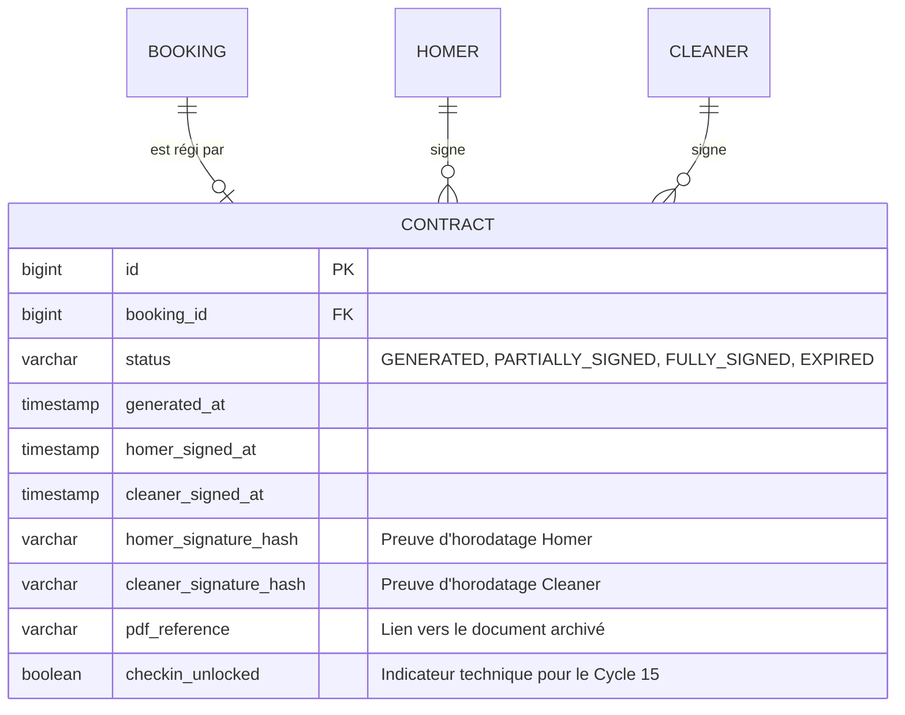
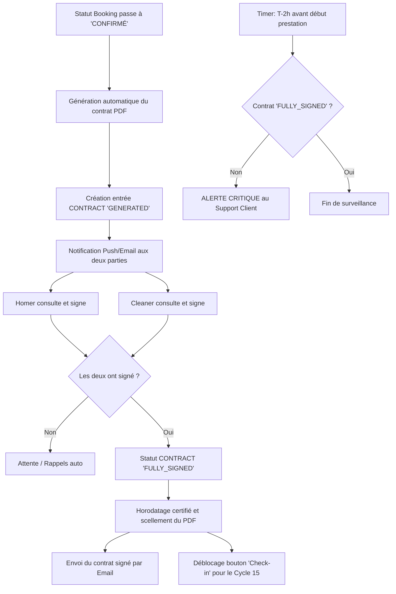

I will begin by researching the existing documentation and specifications to ensure the new business logic integrates seamlessly with the current system architecture and data models.

I will examine the current database state and the history of features to understand the existing entities and their relationships, particularly focusing on the "Booking" and "Billing" models.

I will read the specification for Cycle 12 to see how invoices and documents are currently handled, which will help me design the contract management system consistently with existing patterns.

Voici le dossier de spécifications fonctionnelles pour la feature **[Génération Automatisée et Signature Électronique des Contrats de Prestation]**.

```markdown
# Spécifications Fonctionnelles : Contrats de Prestation & Signature Électronique

## 1. Modèle Conceptuel de Données (MCD) mis à jour

L'entité `CONTRACT` est introduite pour formaliser la relation contractuelle liée à une prestation spécifique. Elle est étroitement liée au cycle de vie du `BOOKING`.



## 2. Diagramme de flux BPMN (Signature et Sécurisation)

Ce flux décrit le cycle de vie du contrat, de sa création automatique à l'archivage final, incluant la gestion des alertes critiques.



## 3. Critères d'Acceptation (Gherkin)

### AC 1 : Génération automatique à la confirmation
**Given** une réservation (`Booking`) effectuée par un Homer auprès d'un Cleaner  
**When** le Cleaner accepte la réservation et que son statut passe à `CONFIRMED`  
**Then** le système doit générer un contrat de prestation au format PDF pré-rempli  
**And** le contrat doit inclure : Identités des parties, adresse du domicile, tarif horaire, date et créneau horaire  
**And** le statut du contrat doit être initialisé à `GENERATED`.

### AC 2 : Workflow de signature simplifiée
**Given** un contrat généré avec le statut `GENERATED` ou `PARTIALLY_SIGNED`  
**When** l'utilisateur (Homer ou Cleaner) clique sur "Signer mon contrat"  
**Then** il doit visualiser le contenu intégral du contrat  
**And** il doit valider son consentement par un clic sur une case "Je reconnais avoir pris connaissance et signe ce contrat"  
**And** le système doit enregistrer l'horodatage exact et l'adresse IP de la signature.

### AC 3 : Blocage opérationnel (Dépendance Cycle 15)
**Given** une réservation confirmée dont le contrat n'est pas encore `FULLY_SIGNED`  
**When** le Cleaner tente d'accéder à l'écran de "Check-in" au début de la mission  
**Then** l'accès doit être bloqué avec un message d'erreur : "Signature obligatoire des deux parties requise pour débuter l'intervention."

### AC 4 : Archivage et distribution automatique
**Given** un contrat venant de recevoir la deuxième signature  
**When** le statut passe à `FULLY_SIGNED`  
**Then** une copie PDF fusionnée (incluant les mentions de signature et horodatages) est envoyée par email aux deux parties  
**And** le document doit être consultable et téléchargeable dans l'onglet "Documents" du profil de chaque utilisateur.

### AC 5 : Alerte de sécurité juridique (Clause de résiliation/urgence)
**Given** une prestation prévue dans 2 heures  
**And** le contrat associé est toujours en statut `GENERATED` ou `PARTIALLY_SIGNED`  
**When** le cron de surveillance s'exécute  
**Then** une alerte critique doit être transmise immédiatement au Support Client pour médiation manuelle ou annulation de sécurité.
```