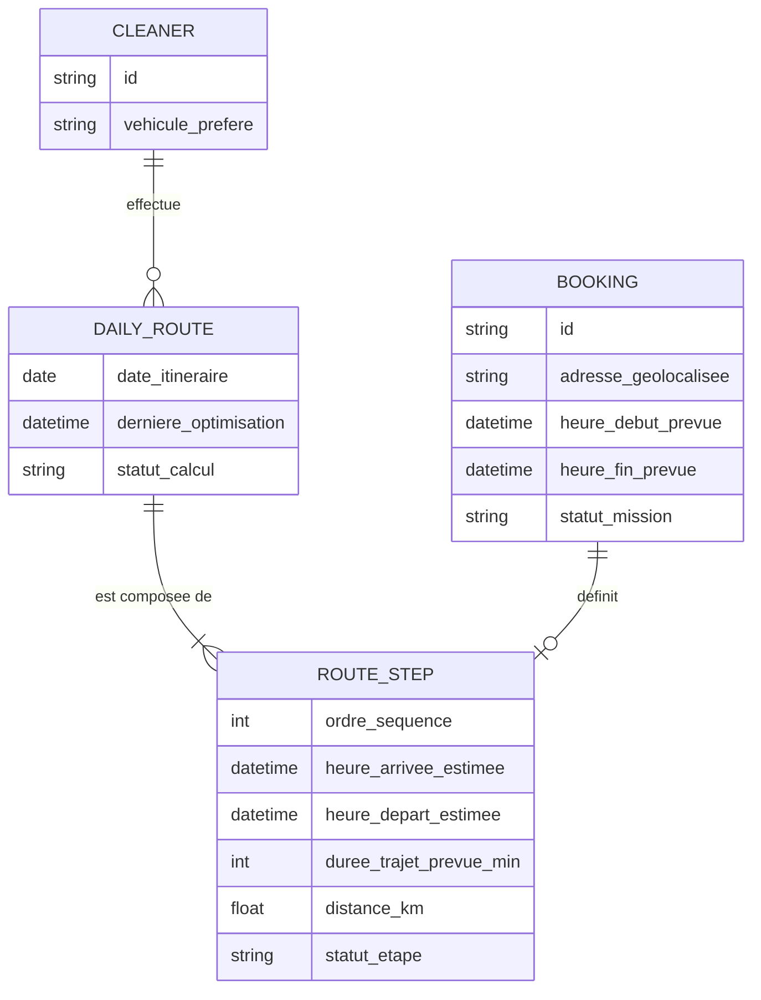
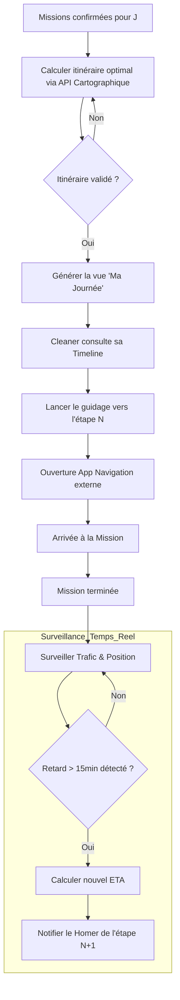

Voici le dossier de conception fonctionnelle pour la feature **[Optimisation de Tournée et Calcul d'Itinéraire pour les Cleaners]**.

### 1. Modèle Conceptuel de Données (MCD)

Ce modèle définit les entités et relations nécessaires pour supporter l'intelligence logistique et le suivi des itinéraires sans présumer de l'implémentation technique.

### 2. Diagramme de flux (BPMN)

Ce diagramme illustre le cycle de vie d'une tournée, de son calcul à l'exécution avec gestion des aléas.

### 3. Critères d'Acceptation (Gherkin)

**Scénario 1 : Calcul automatique de l'itinéraire optimal**
*   **Given** un Cleaner ayant au moins 2 missions confirmées pour la même journée.
*   **When** le Cleaner accède à l'écran "Ma Journée".
*   **Then** le système doit calculer l'ordre de passage minimisant le temps de trajet total.
*   **And** afficher les étapes numérotées sur une carte interactive.

**Scénario 2 : Consultation de la Timeline "Ma Journée"**
*   **Given** une tournée calculée pour un Cleaner.
*   **When** le Cleaner visualise sa timeline.
*   **Then** il doit voir pour chaque mission : l'heure de départ prévue de sa position actuelle, la durée estimée du trajet (trafic inclus) et l'heure d'arrivée estimée (ETA).

**Scénario 3 : Notification prédictive de retard**
*   **Given** un Cleaner en déplacement entre la Mission A et la Mission B.
*   **When** les conditions de trafic réel augmentent le temps de trajet de telle sorte que l'ETA dépasse de plus de 10 minutes l'heure de début prévue de la Mission B.
*   **Then** une notification automatique est envoyée au Client (Homer) de la Mission B pour l'informer du nouvel horaire d'arrivée.

**Scénario 4 : Lancement du guidage externe**
*   **Given** une mission sélectionnée dans la timeline.
*   **When** le Cleaner appuie sur le bouton "Lancer le guidage".
*   **Then** l'application doit proposer le choix entre les applications de navigation installées (Waze, Google Maps, Apple Maps).
*   **And** transmettre les coordonnées GPS exactes de la destination à l'application choisie.

**Scénario 5 : Mise à jour dynamique de la tournée**
*   **Given** une tournée en cours d'exécution.
*   **When** une nouvelle mission est confirmée en "dernière minute" pour la même journée.
*   **Then** le système doit recalculer instantanément l'itinéraire optimal intégrant ce nouveau point d'arrêt.