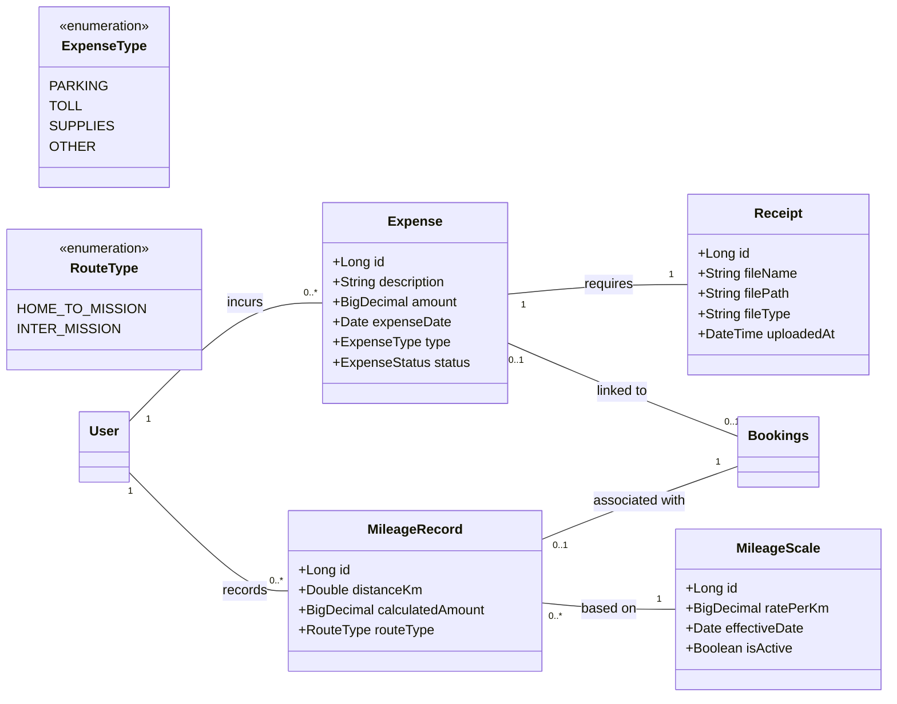
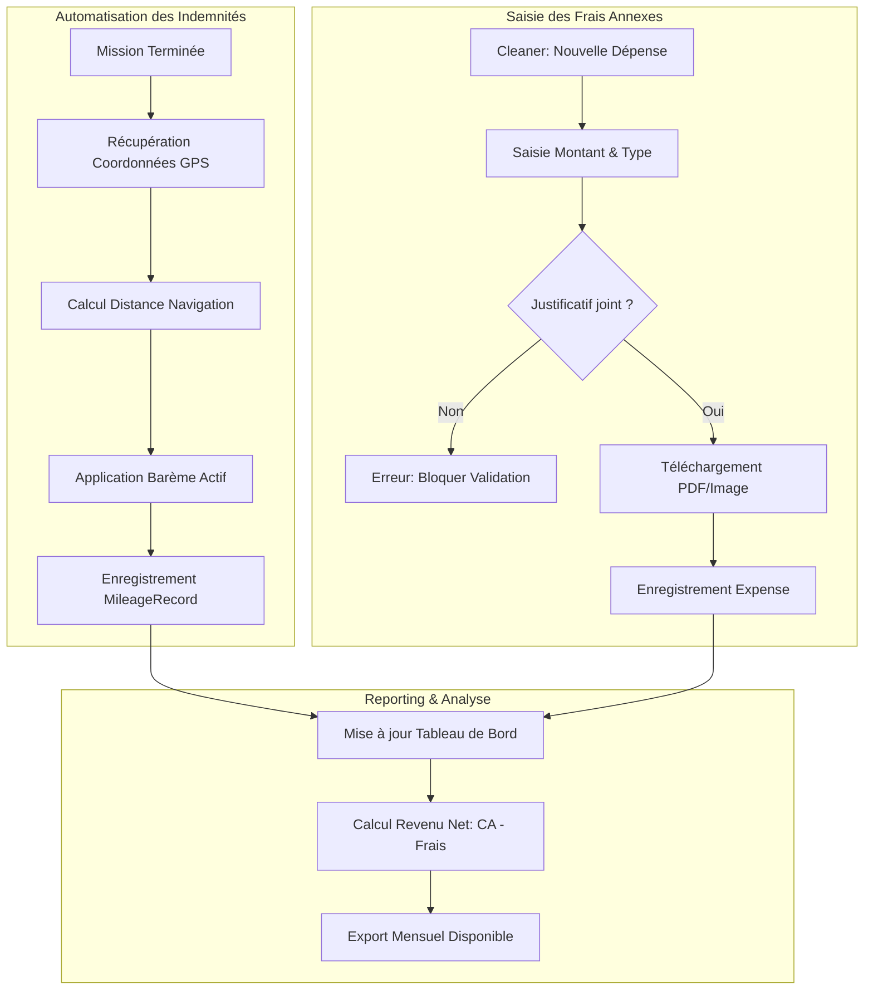

I will start by analyzing the current database schema to ensure the new entities for expenses and mileage are correctly integrated with existing tables like `missions`, `users`, and `invoices`.
I will list the contents of the `sweet-home-postgres` directory to locate the correct schema file.
I will read the `schema.sql` file from the correct directory, `sweet-home-app/sweethome-postgres/`, to understand the current data structure.
Voici la modélisation métier pour le **Système de Gestion des Frais Professionnels et Indemnités Kilométriques**.

### 1. Modèle Conceptuel de Données (MCD)
Ce modèle intègre la gestion des barèmes, des justificatifs et le lien avec les prestations existantes.

---

### 2. Diagramme de Flux (BPMN)
Le flux décrit l'automatisation des indemnités et la gestion manuelle des frais annexes.

---

### 3. Critères d'Acceptation (Given/When/Then)

#### Scénario 1 : Calcul automatique des indemnités kilométriques
**Given** Un Cleaner a terminé une mission "A" à 14h00 et commence une mission "B" à 15h00
**When** Le statut de la mission "B" passe à "COMPLETED"
**Then** Le système calcule la distance réelle entre l'adresse de "A" et "B"
**And** Le système génère un `MileageRecord` en multipliant cette distance par le `MileageScale` en vigueur
**And** Ce montant est déduit du "Revenu Net" affiché sur le dashboard du Cleaner

#### Scénario 2 : Saisie d'un frais annexe avec justificatif obligatoire
**Given** Un Cleaner sur son interface de gestion des frais
**When** Il tente d'enregistrer une dépense de type "Parking" sans télécharger de fichier
**Then** Le système affiche un message d'erreur "Un justificatif est obligatoire"
**And** L'enregistrement en base de données est refusé

#### Scénario 3 : Modification du barème kilométrique par l'Admin
**Given** Un Administrateur système
**When** Il modifie le tarif du barème kilométrique à 0.60€/km
**Then** Les nouveaux calculs de `MileageRecord` utilisent ce tarif
**And** Les enregistrements passés conservent le tarif historique au moment de leur création

#### Scénario 4 : Exportation des données comptables
**Given** Un Cleaner avec plusieurs frais et déplacements enregistrés sur le mois de Mars
**When** Il clique sur "Exporter le récapitulatif mensuel (PDF)"
**Then** Le système génère un document contenant le détail chronologique des trajets et des frais
**And** Le document affiche le total du Chiffre d'Affaires Brut, le total des Frais, et le Bénéfice Net final

#### Scénario 5 : Répercussion des frais sur le devis (Optionnel)
**Given** Un Cleaner créant un devis pour un Homer
**When** Il coche l'option "Inclure frais de déplacement réels"
**Then** Le système estime le montant des indemnités kilométriques basées sur la distance Domicile-Homer
**And** Ce montant est ajouté comme ligne de service distincte sur le devis envoyé au Homer