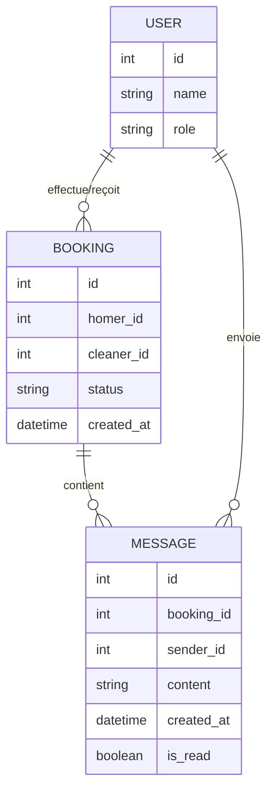
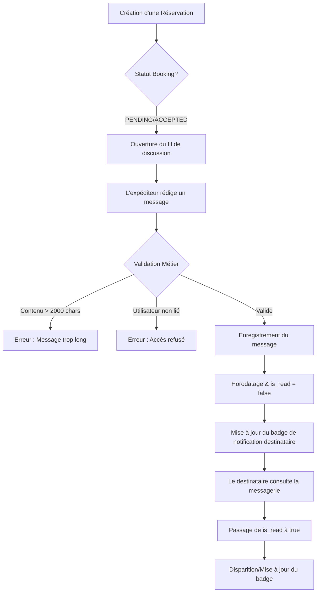

Je vais analyser la demande pour le Système de Messagerie Interne et produire les livrables métier requis (MCD, BPMN et Critères d'Acceptation) en me basant sur les règles de gestion fournies.

### 1. Modèle Conceptuel de Données (MCD) mis à jour

### 2. Diagramme de flux (BPMN)

### 3. Critères d'Acceptation (Gherkin)

#### Scénario 1 : Initialisation automatique de la conversation
**Given** une nouvelle demande de réservation est créée par un Homer
**And** le statut de la réservation est `PENDING`
**When** le Cleaner ou l'Homer accède à son Dashboard
**Then** un fil de discussion vide rattaché à cette réservation spécifique doit être disponible pour les deux participants.

#### Scénario 2 : Envoi d'un message valide
**Given** un utilisateur (Homer ou Cleaner) authentifié sur un fil de discussion actif
**And** le message contient entre 1 et 2000 caractères
**When** l'utilisateur valide l'envoi du message
**Then** le message est enregistré avec l'ID de l'expéditeur
**And** l'horodatage `created_at` correspond à l'heure précise de l'action
**And** le statut `is_read` est initialisé à `false`.

#### Scénario 3 : Réception et Notification
**Given** qu'un message a été envoyé par l'Homer au Cleaner
**And** le Cleaner n'a pas encore lu le message (`is_read` = `false`)
**When** le Cleaner se connecte à son Dashboard
**Then** un indicateur visuel (badge) doit apparaître sur l'icône de messagerie
**And** le compteur de messages non lus doit être incrémenté de 1.

#### Scénario 4 : Lecture d'un message
**Given** un destinataire visualisant un badge de nouveau message
**When** le destinataire ouvre la conversation spécifique pour lire le contenu
**Then** tous les messages reçus dans ce fil passent à `is_read` = `true`
**And** le badge de notification du Dashboard disparaît ou se met à jour.

#### Scénario 5 : Sécurité et Isolation des échanges
**Given** une réservation entre l'Homer "A" et le Cleaner "B"
**When** un utilisateur "C" (Homer ou Cleaner externe à la prestation) tente d'accéder au fil de discussion
**Then** l'accès doit être strictement refusé
**And** aucune donnée du message ne doit être transmise.

#### Scénario 6 : Tri chronologique
**Given** une conversation contenant plusieurs échanges
**When** l'utilisateur affiche le fil de discussion
**Then** les messages doivent être ordonnés du plus ancien au plus récent (flux de lecture naturel).