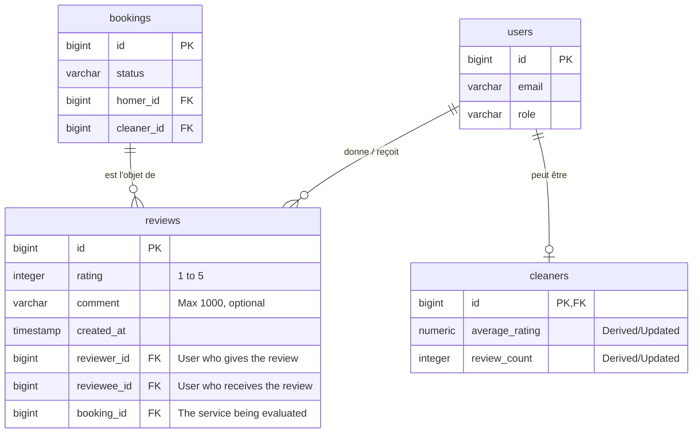
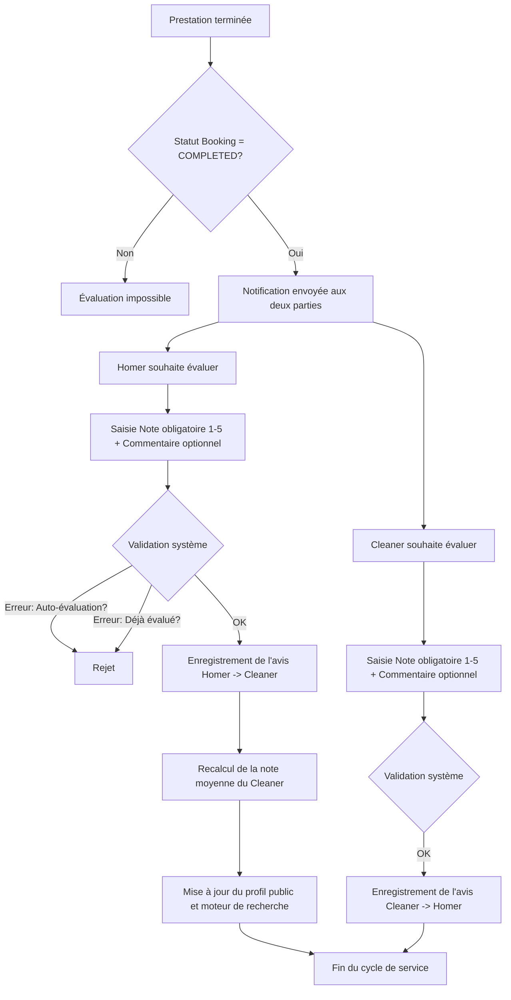

J'analyse les documents d'architecture et le schéma de base de données existant pour intégrer le système de notation de manière cohérente avec le modèle actuel.

Je vérifie la structure exacte de la table `reviews` et `bookings` dans le fichier SQL pour confirmer les colonnes existantes.

Voici le livrable métier pour le **Système de Notation et d'Évaluation des Prestations**.

### 1. Modèle Conceptuel de Données (MCD) mis à jour

L'évolution majeure réside dans l'ajout d'une relation obligatoire entre la table `reviews` et `bookings` pour garantir qu'un avis est toujours rattaché à une prestation réelle. La colonne `comment` devient optionnelle.

### 2. Diagramme de Flux BPMN

Ce diagramme décrit le processus de clôture de la prestation et le cycle de feedback bidirectionnel.

### 3. Critères d'Acceptation (Gherkin)

#### Scénario 1 : Évaluation d'un Cleaner par un Homer
**Given** une réservation entre le Homer "Jean" et le Cleaner "Maria"
**And** le statut de la réservation est "COMPLETED"
**When** "Jean" soumet une note de "5" avec le commentaire "Travail impeccable" pour cette réservation
**Then** l'avis est enregistré avec succès
**And** la note moyenne de "Maria" est recalculée en incluant ce nouveau 5/5
**And** Maria ne peut pas être évaluée une seconde fois par Jean pour cette même réservation.

#### Scénario 2 : Évaluation d'un Homer par un Cleaner (Fiabilité)
**Given** une réservation entre le Homer "Jean" et le Cleaner "Maria"
**And** le statut de la réservation est "COMPLETED"
**When** "Maria" soumet une note de "4" pour "Jean" concernant cette réservation
**Then** l'avis est enregistré avec succès
**And** le score de fiabilité de "Jean" est mis à jour sur son profil interne.

#### Scénario 3 : Tentative d'évaluation prématurée
**Given** une réservation dont le statut est "ACCEPTED" ou "PENDING"
**When** un utilisateur tente de soumettre un avis pour cette réservation
**Then** le système rejette la demande
**And** un message d'erreur indique que la prestation doit être terminée pour être évaluée.

#### Scénario 4 : Interdiction d'auto-évaluation
**Given** une réservation "COMPLETED" où "Maria" est le Cleaner
**When** "Maria" tente de soumettre un avis où elle est à la fois `reviewer` et `reviewee`
**Then** le système bloque l'action pour conflit d'intérêt.

#### Scénario 5 : Immuabilité des avis
**Given** un avis déjà publié par "Jean" pour une réservation
**When** "Jean" tente de modifier la note ou le commentaire de cet avis
**Then** l'accès en modification est refusé
**And** le système indique que les avis sont définitifs.

#### Scénario 6 : Respect des contraintes de saisie
**Given** l'interface de notation
**When** l'utilisateur tente de valider sans sélectionner d'étoiles
**Then** la validation échoue (Note obligatoire)
**When** l'utilisateur saisit un commentaire de 1200 caractères
**Then** le système tronque ou refuse la validation (Limite 1000 caractères).