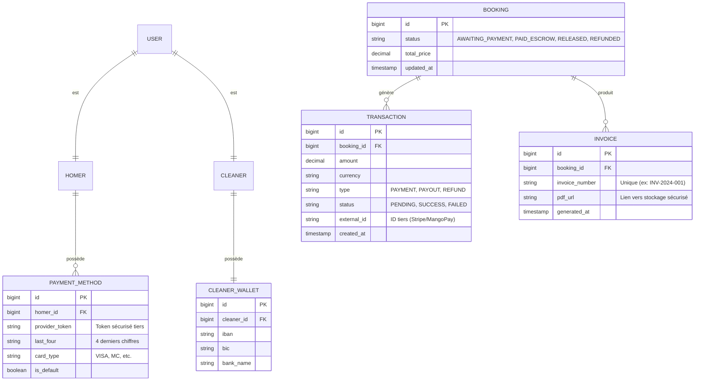
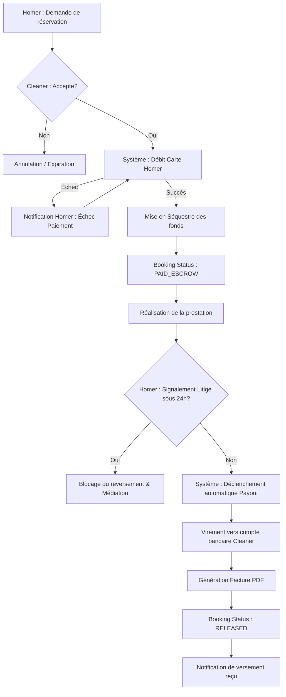

I will start by analyzing the existing database schema to understand how to integrate the new payment and escrow features into the Conceptual Data Model.
I will read the database schema from the correct path to identify where to add the payment and escrow entities.
Voici le dossier de conception fonctionnelle pour le **Système de Paiement Sécurisé et Séquestre des Fonds**.

### 1. Modèle Conceptuel de Données (MCD) mis à jour

Ce diagramme intègre les nouvelles entités nécessaires à la gestion des flux financiers et met à jour le cycle de vie des réservations.

### 2. Diagramme de flux BPMN

Le flux décrit le cycle de vie "Heureux" (Happy Path) du paiement, de la réservation au reversement final.

### 3. Critères d'Acceptation (Given/When/Then)

#### Scénario 1 : Débit et Séquestre à la confirmation
- **Given** Un Homer ayant une carte bancaire enregistrée et une réservation en attente.
- **When** Le Cleaner accepte officiellement la réservation via son dashboard.
- **Then** Le système tente de débiter le montant total `total_price` de la carte de l'Homer.
- **And** Si le débit réussit, le statut de la réservation passe à `PAID_ESCROW`.
- **And** Une `TRANSACTION` de type `PAYMENT` est créée avec le statut `SUCCESS`.

#### Scénario 2 : Reversement automatique (Payout)
- **Given** Une réservation avec le statut `PAID_ESCROW` dont la date de fin de prestation est dépassée de 24 heures.
- **When** Aucun litige n'a été ouvert par l'Homer via la plateforme.
- **Then** Le système ordonne un virement du montant (net de commission) vers le `CLEANER_WALLET` enregistré.
- **And** Le statut de la réservation devient `RELEASED`.
- **And** Une `TRANSACTION` de type `PAYOUT` est enregistrée.

#### Scénario 3 : Configuration du compte bancaire Cleaner
- **Given** Un Cleaner connecté souhaitant recevoir ses gains.
- **When** Il saisit son IBAN et son BIC dans son profil.
- **Then** Le système valide le format de l'IBAN.
- **And** Les informations sont stockées de manière cryptée dans la table `CLEANER_WALLET`.
- **And** Le Cleaner peut désormais recevoir des paiements automatiques.

#### Scénario 4 : Génération et consultation de facture
- **Given** Une prestation dont le paiement est passé au statut `RELEASED`.
- **When** L'Homer ou le Cleaner clique sur "Télécharger la facture" depuis son historique.
- **Then** Un fichier PDF est généré dynamiquement avec :
    - Numéro de facture unique.
    - Coordonnées des deux parties.
    - Détails de la prestation (date, durée, tarif).
    - Statut "Payé".