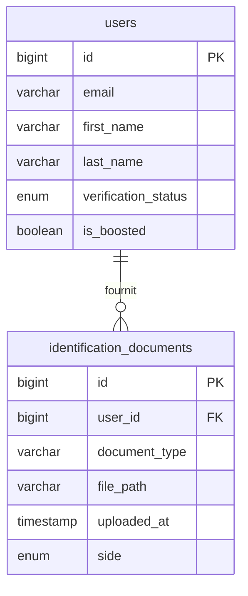
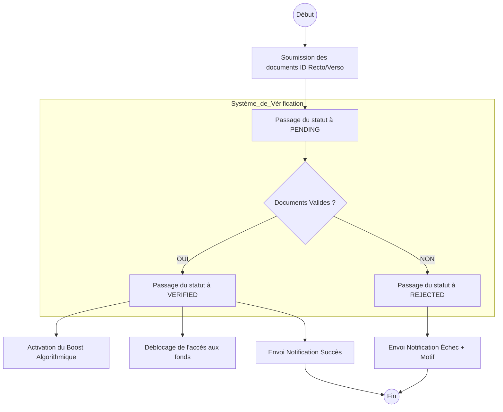

I will read the current database schema and architecture documentation to ensure the new business logic integrates correctly with the existing system.
Voici le dossier de conception fonctionnelle pour la feature **Vérification d'Identité (KYC) et Certification des Profils**, structuré pour une implémentation technique immédiate.

### 1. Modèle Conceptuel de Données (MCD) mis à jour

L'entité `users` est enrichie pour suivre le cycle de vie de la vérification, et une nouvelle entité `identification_documents` est introduite pour tracer les preuves soumises.

---

### 2. Diagramme de Flux BPMN (Processus de Vérification)

Ce diagramme détaille le parcours utilisateur, de la soumission à la notification finale, en intégrant les impacts sur le moteur de recherche et les paiements.

---

### 3. Critères d'Acceptation (Gherkin)

#### Scénario 1 : Soumission des documents KYC
**Given** un utilisateur connecté dont le statut est `NOT_STARTED` ou `REJECTED`
**When** l'utilisateur télécharge une image pour le recto et une image pour le verso de sa pièce d'identité
**Then** le statut `verification_status` de l'utilisateur passe à `PENDING`
**And** les documents sont enregistrés et liés à son profil

#### Scénario 2 : Affichage de la crédibilité (Badge)
**Given** un utilisateur (Homer ou Cleaner) dont le statut est `VERIFIED`
**When** son profil est consulté ou apparaît dans les résultats de recherche
**Then** un badge visuel "Identité Vérifiée" est affiché à côté de son nom

#### Scénario 3 : Boost algorithmique pour les Cleaners
**Given** deux Cleaners ayant des compétences et une localisation identiques
**And** le Cleaner A est `VERIFIED` et le Cleaner B est `NOT_STARTED`
**When** un Homer effectue une recherche de prestataires
**Then** le Cleaner A doit apparaître dans une position supérieure au Cleaner B dans les résultats

#### Scénario 4 : Sécurisation des paiements (Condition de déblocage)
**Given** un Cleaner ayant réalisé une prestation dont les fonds sont sous séquestre
**When** le Cleaner tente de transférer ses gains vers son compte bancaire
**Then** le système doit bloquer le transfert si son statut est différent de `VERIFIED`
**And** un message d'information doit l'inviter à compléter sa vérification d'identité

#### Scénario 5 : Notification de mise à jour de statut
**Given** un utilisateur avec un dossier de vérification en attente (`PENDING`)
**When** le système (ou un administrateur) valide ou rejette les documents
**Then** l'utilisateur reçoit immédiatement une notification (Email/In-app) confirmant le nouveau statut (`VERIFIED` ou `REJECTED`)