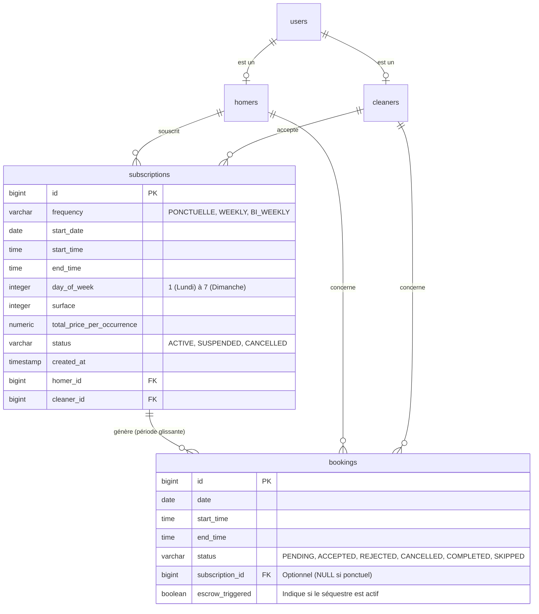

I will start by reading the existing database schema and architecture documentation to ensure the updated Conceptual Data Model (MCD) is consistent with the current system.

Voici le dossier de spécifications fonctionnelles pour la feature **Planification de Prestations Récurrentes (Abonnement)**.

### 1. Modèle Conceptuel de Données (MCD) mis à jour

L'ajout majeur est l'entité `subscriptions` (Abonnements) qui agit comme un contrat cadre pour la génération automatique des prestations (`bookings`).



### 2. Diagramme de flux BPMN

Le diagramme ci-dessous détaille le cycle de vie de l'abonnement, de la souscription à la gestion de la période glissante.

```mermaid
graph TD
    %% Création de l'abonnement
    Start((Début)) --> SubRequest[Homer : Demande d'abonnement <br/>avec fréquence & créneau]
    SubRequest --> CleanerDecision{Cleaner : <br/>Accepter la série ?}
    
    CleanerDecision -- Refus --> EndRefus((Fin : Demande rejetée))
    
    CleanerDecision -- Acceptation --> CreateSub[Création de l'entité Subscription <br/>Status: ACTIVE]
    
    %% Génération glissante
    CreateSub --> GenBookings[Génération auto des 8 <br/>prochaines occurrences]
    
    %% Cycle de vie d'une occurrence
    GenBookings --> Wait24h{H-24 avant <br/>occurrence ?}
    
    Wait24h -- Oui --> TriggerEscrow[Déclenchement auto <br/>du séquestre (Paiement)]
    
    TriggerEscrow --> Execution[Réalisation de la prestation]
    
    %% Maintenance de la fenêtre
    Execution --> CheckWindow[Vérification fenêtre glissante <br/>de 8 semaines]
    CheckWindow --> GenNext[Génération du créneau S+8]
    GenNext --> Wait24h
    
    %% Suspension (Flux parallèle)
    SuspendEvent[Homer : Suspendre une <br/>occurrence spécifique] --> Check72h{Délai > 72h ?}
    Check72h -- Non --> Error[Action impossible]
    Check72h -- Oui --> MarkSkipped[Booking marqué <br/>comme SKIPPED]
    MarkSkipped --> NoEscrow[Pas de séquestre <br/>pour ce booking]
```

### 3. Critères d'Acceptation (Given/When/Then)

#### Scénario 1 : Création d'un abonnement hebdomadaire
*   **Given** Un Homer sur le profil d'un Cleaner disponible.
*   **When** Le Homer sélectionne la fréquence "Hebdomadaire", choisit un créneau (ex: Lundi 09h00) et valide la demande.
*   **Then** Le Cleaner reçoit une notification pour une demande de récurrence.
*   **And** Si le Cleaner accepte, 8 objets `booking` sont automatiquement créés dans la base de données pour les 8 prochains lundis.

#### Scénario 2 : Automatisation du séquestre (Paiement)
*   **Given** Un abonnement actif avec une occurrence prévue dans 24 heures.
*   **When** Le système atteint le seuil H-24 avant le début du `booking`.
*   **Then** Le processus de paiement sécurisé (séquestre) est déclenché automatiquement sur la carte du Homer.
*   **And** Le statut du `booking` passe en mode "Paiement Séquestré".

#### Scénario 3 : Suspension d'une occurrence (Vacances)
*   **Given** Un abonnement actif avec un `booking` prévu dans 5 jours (soit > 72h).
*   **When** Le Homer choisit de "Suspendre ce passage" depuis son dashboard.
*   **Then** Le `booking` spécifique passe au statut "SKIPPED".
*   **And** Aucun paiement n'est prélevé pour cette occurrence.
*   **And** L'abonnement global reste "ACTIVE" et les occurrences suivantes sont maintenues.

#### Scénario 4 : Suspension tardive (Règle métier des 72h)
*   **Given** Un abonnement actif avec un `booking` prévu dans 48 heures (soit < 72h).
*   **When** Le Homer tente de suspendre le passage.
*   **Then** Le système affiche un message d'erreur indiquant que le délai de préavis est dépassé.
*   **And** Le `booking` reste maintenu et le séquestre sera déclenché à H-24.

#### Scénario 5 : Résiliation globale
*   **Given** Un abonnement actif.
*   **When** Le Homer ou le Cleaner sélectionne "Résilier l'abonnement".
*   **Then** Le statut de la `subscription` passe à "CANCELLED".
*   **And** Tous les `bookings` associés ayant un statut "PENDING" ou "ACCEPTED" (et dont le séquestre n'est pas encore déclenché) sont supprimés ou annulés.