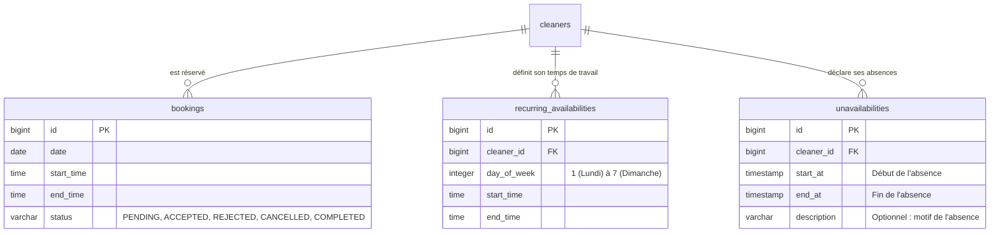
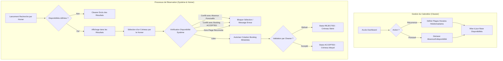

I will begin by researching the current database schema and existing architectural documentation to ensure the updated Conceptual Data Model (MCD) integrates seamlessly with the existing system.
I will now check the `backlog/feature-auto-cycle-9.md` and `product/specs/spec-feature-auto-cycle-9.md` (if they exist) to ensure my proposal aligns with any existing project planning or notes.
I will read the `backlog/feature-auto-cycle-9.md` file to gather any additional business logic or constraints that should be reflected in the final deliverable.
Voici le livrable métier structuré pour la feature **"Gestion du Calendrier de Disponibilités et des Indisponibilités"**.

### 1. Modèle Conceptuel de Données (MCD) mis à jour

Ce diagramme intègre les nouvelles entités de gestion du temps au schéma existant.

---

### 2. Diagramme de flux BPMN

Le flux décrit la gestion par le Cleaner et la vérification automatisée lors du processus de réservation par un Homer.

---

### 3. Critères d'Acceptation (Given/When/Then)

#### CA 1 : Définition des disponibilités récurrentes
*   **Given** Un Cleaner authentifié sur son tableau de bord.
*   **When** Il saisit une plage horaire (ex: 08:00 - 12:00) pour un jour de la semaine spécifique (ex: Lundi).
*   **Then** Le système enregistre cette récurrence et la rend visible sur son calendrier de gestion.
*   **Then** Le Cleaner devient éligible à apparaître dans les résultats de recherche pour ce jour et ce créneau.

#### CA 2 : Déclaration d'une indisponibilité ponctuelle (prioritaire)
*   **Given** Un Cleaner ayant une disponibilité récurrente définie le Mardi de 09:00 à 17:00.
*   **When** Il déclare une indisponibilité ponctuelle le Mardi 24 Mars de 10:00 à 11:00 (Rendez-vous).
*   **Then** Le créneau 10:00 - 11:00 du 24 Mars est marqué comme "Indisponible" sur son calendrier.
*   **Then** Un Homer ne peut pas réserver de prestation chevauchant ce créneau spécifique, bien que la récurrence hebdomadaire existe.

#### CA 3 : Blocage automatique par réservation confirmée
*   **Given** Un Cleaner ayant une réservation au statut `ACCEPTED` le Vendredi de 14:00 à 16:00.
*   **When** Un autre Homer tente de sélectionner un créneau le même Vendredi de 15:00 à 17:00.
*   **Then** Le système empêche la sélection car le créneau 15:00 - 16:00 est déjà occupé par une réservation confirmée.

#### CA 4 : Exclusion du moteur de recherche
*   **Given** Un Cleaner qui n'a configuré aucune `recurring_availability`.
*   **When** Un Homer effectue une recherche de cleaners dans la ville dudit Cleaner.
*   **Then** Le Cleaner n'apparaît pas dans la liste des résultats, quel que soit son statut d'activation global.

#### CA 5 : Cohérence des données de temps
*   **Given** Un Cleaner saisissant une indisponibilité.
*   **When** L'heure de fin est antérieure ou égale à l'heure de début.
*   **Then** Le système rejette la saisie avec un message d'erreur explicite et n'enregistre aucune donnée.